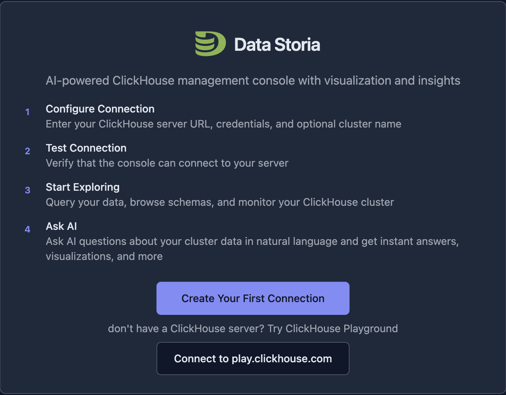
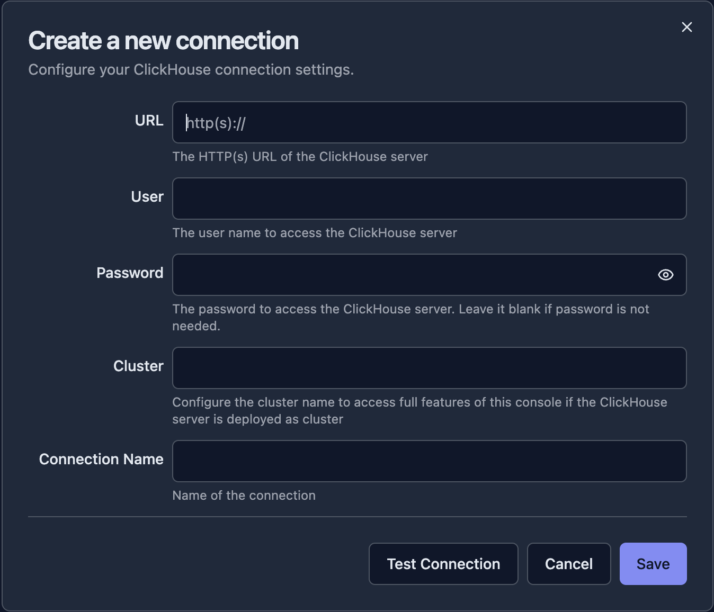
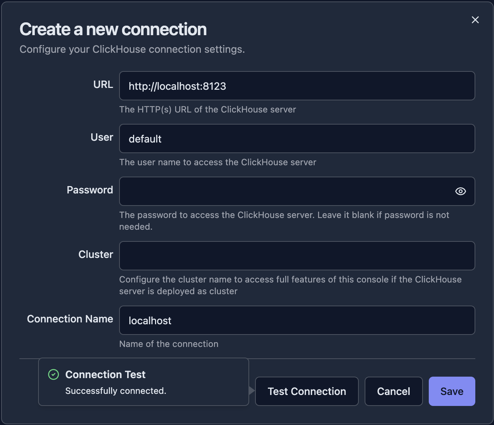
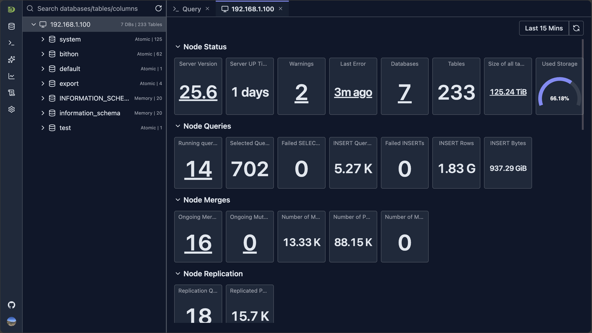

# First Connection

This guide will walk you through connecting DataStoria to your ClickHouse instance for the first time.

## Before You Begin

Make sure you have:

- ✅ DataStoria installed and running (see [Installation & Setup](./installation.md))
- ✅ Access to a ClickHouse server (local or remote)
- ✅ Connection credentials (host, port, username, password, database)

## Connection Methods

DataStoria supports multiple connection methods depending on your ClickHouse setup:

### Standard HTTP Connection

This is the most common method for connecting to ClickHouse.

#### Connection Parameters

- **Host**: Your ClickHouse server address (e.g., `localhost`, `clickhouse.example.com`, or an IP address)
- **Port**: ClickHouse HTTP port (default: `8123`)
- **Database**: The database name you want to connect to (optional, can be selected later)
- **Username**: Your ClickHouse username
- **Password**: Your ClickHouse password
- **Protocol**: HTTP or HTTPS

### Secure HTTPS Connection

For production environments, use HTTPS for encrypted connections.

#### Additional Parameters

- **Protocol**: Select HTTPS
- **Port**: Usually `443` for HTTPS (or your configured HTTPS port)
- **SSL Verification**: Enable to verify SSL certificates

### Connection via Proxy

If your ClickHouse server is behind a proxy or load balancer:

1. Enter the proxy address as the host
2. Use the proxy port
3. Ensure the proxy forwards requests to your ClickHouse server

## Step-by-Step Connection Guide

### Step 1: Open DataStoria

1. Navigate to `http://localhost:3000` (or your configured port)
2. You'll see the DataStoria welcome screen

### Step 2: Create Your First Connection

Click the 'Create Your First Connection' button, it will brings you to the connection setup dialog

### Step 3: Enter Connection Details

Fill in the connection form with your ClickHouse details:

| Property | Description | Example |
|----------|------------|---------|
| URL | The ClickHouse server URL with protocol and port | `http://localhost:8123` |
| User | Your ClickHouse username | `default` |
| Password | (Optional) Your ClickHouse instance password | `<your ClickHouse instance password>` |
| Cluster | (Optional) If your ClickHouse cluster has multiple replicas, you can set this to your cluster name so that you can access all nodes in the this application.   If configured, it should be the name from your cluster configuration (SHOW CLUSTERS). | `my_cluster` |
| Connection Name | A friendly name to identify this connection. By default it's auto filled by the host name in the URL, but it's recommended to change it to your own. | `My ClickHouse` | 

### Step 4: Test Connection

1. Click **"Test Connection"** to verify your settings
2. Wait for the connection test to complete
3. If successful, you'll see a confirmation message will be shown on the left of the button

### Step 5: Save and Connect

Click **"Save"** to store the connection and the application will connect to your ClickHouse instance and bring you to the main UI.

> NOTE: Connection information is saved in your local NOT the server side for privacy consideration.

## Basic Navigation

Once connected, the application automatically opens the query editor and dashboard of the node where the first response is returned, and you'll see the main DataStoria interface like below:

### Main Components

1. **Sidebar** — Navigate between:
   - Connections
   - Query Tabs
   - Chat Tabs
   - Dashboards
   - System Tables Instrospection
   - Settings

2. **Schema Tree**
   
   The view shows all database/tables/columns information and support global search capability.
   It's also the main entry point of other features like table metadata.

3. **Main Tab Region**
   The main work region, including query editors, dashboards...

4. **Right panel**
   By default it's hidden, and chat panel can be displayed there

### Your First Query

Click the 'Query' tab or click the query icon button from the side bar, it shows the query view, and write the SQL in the editor and run it.

## Multiple Connections

DataStoria supports managing multiple ClickHouse clusters:

1. **Add New Connection**: Move mouse to the database icon button on the side bar, and  choose "Add Connection"
2. **Switch Between Connections**: Select connection from the drop down list of the database icon button on the side bar
3. **Manage Connections**: Click the 'Edit' icon button of a selected connection from the drop down connection list of database icon button on the side bar

## Connection Troubleshooting

### Common Issues

#### Connection Refused

**Problem**: "Connection refused" or "Cannot connect to server"

**Solutions**:
- Verify ClickHouse is running
- Check firewall settings
- Verify the host and port are correct
- Ensure ClickHouse HTTP interface is enabled
- Verify HTTPS or HTTP

#### Authentication Failed

**Problem**: "Authentication failed" or "Invalid credentials"

**Solutions**:
- Double-check username and password
- Verify the user exists in ClickHouse
- Check if the user has proper permissions
- Try connecting with the `default` user first

## What's Next?

Now that you're connected, explore these features:

- **[Schema Explorer](../04-cluster-management/schema-explorer.md)** — Browse your databases and tables
- **[SQL Editor](../03-query-experience/sql-editor.md)** — Start writing and executing queries
- **[Natural Language Queries](../02-ai-features/natural-language-sql.md)** — Ask questions in plain English

