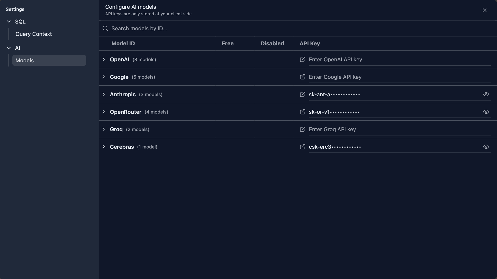

# AI Model Configuration

DataStoria's AI features require a Large Language Model (LLM) provider to function. This guide explains how to configure your LLM provider API keys and manage your AI settings.

> **Prerequisites**: Make sure you have [DataStoria installed](../01-getting-started/installation.md) and [connected to ClickHouse](../01-getting-started/first-connection.md).

## Overview

DataStoria uses LLM providers to power its AI features:
- **Natural Language Data Exploration**: Converts natural language to SQL queries
- **Query Optimization**: Analyzes and optimizes SQL queries
- **Intelligent Visualization**: Generates charts from descriptions
- **Error Diagnostics**: Provides AI-powered error fixes

All AI features use your own API keys, ensuring your data and prompts remain private.

## Setting Up API Keys

### Step 1: Access LLM Settings

1. Open DataStoria
2. Navigate to ⚙️ **Settings** from the sidebar
3. Click on **App Settings**
4. Select AI --> Models on the settings page

### Step 2: Choose a Provider

DataStoria supports multiple LLM providers. Select the one that best fits your needs:

| Provider | Models Available | Best For |
|----------|-----------------|----------|
| **OpenAI** | GPT-4, GPT-4 Turbo, GPT-3.5 | General purpose, high quality |
| **Anthropic** | Claude 3 (Opus, Sonnet, Haiku) | Complex reasoning, long context |
| **Google** | Gemini Pro, Gemini Ultra | Multimodal, Google ecosystem |
| **Groq** | Llama, Mixtral | Fast inference, cost-effective |
| **OpenRouter** | Multiple models | Access to many providers |
| **Cerebras** | GPT-OSS-120B | High-performance, large-scale models |

If your providers are not listed above, refer to the [Adding More Providers](#adding-more-providers) below to add your own providers.

### Step 3: Get Your API Key

Visit your provider's website to obtain an API key:

| Model Provider | Link |
|---------------|------|
| **OpenAI** | [platform.openai.com/api-keys](https://platform.openai.com/api-keys) |
| **Anthropic** | [console.anthropic.com/settings/keys](https://console.anthropic.com/settings/keys) |
| **Google** | [aistudio.google.com/app/apikey](https://aistudio.google.com/app/apikey) |
| **Groq** | [console.groq.com/keys](https://console.groq.com/keys) |
| **OpenRouter** | [openrouter.ai/settings/keys](https://openrouter.ai/settings/keys) |
| **Cerebras** | [cloud.cerebras.ai/platform](https://cloud.cerebras.ai/platform) |

### Step 4: Configure in DataStoria

Paste your API keys to relavent providers. And if you want to disable some models, just click the Switch button so that these disabled models will not be listed in the selection list in the chat panel.

![model-configuration-search].png

## Privacy and Security

### Data Privacy

- **No Data Collection**: DataStoria doesn't collect or store your conversations as well as API keys

- **Your API Keys**: Stored locally in your browser, never sent to DataStoria servers

- **Your Questions**: Will send to the server, but server don't store any conservation history

- **LLM Response**: Never stored in the server

### Security Best Practices

1. **Keep Keys Secret**: Never share your API keys publicly
2. **Use Environment Variables**: For local installations, consider using environment variables
3. **Rotate Keys Regularly**: Periodically regenerate your API keys
4. **Monitor Usage**: Check your provider's dashboard for unusual activity
5. **Set Usage Limits**: Configure spending limits in your provider account

### Local Storage

API keys are stored in your browser's local storage:
- **Access**: Only accessible from the browser where you configured them
- **Persistence**: Keys persist across browser sessions
- **Clear Data**: Clearing browser data will remove stored keys

### Common Issues

#### Invalid API Key

**Problem**: "Invalid API key" error

**Solutions**:
- Verify the key is copied correctly (no extra spaces)
- Check if the key has expired or been revoked
- Ensure you're using the correct key for the selected provider
- Regenerate the key from your provider's dashboard

#### Rate Limiting

**Problem**: "Rate limit exceeded" errors

**Solutions**:
- Check your provider's rate limits
- Upgrade your provider plan if needed
- Use a different model with higher limits
- Wait before retrying

## Cost Management

### Understanding Pricing

Most providers charge based on:
- **Input Tokens**: Text you send to the model
- **Output Tokens**: Text generated by the model
- **Model Type**: Different models have different rates

### Cost Optimization Tips

1. **Use Appropriate Models**: Don't use expensive models for simple tasks
2. **Optimize Prompts**: Shorter, clearer prompts use fewer tokens
3. **Cache Results**: Reuse similar queries when possible
4. **Set Budget Alerts**: Configure spending alerts in provider dashboard
5. **Monitor Usage**: Regularly check your usage and costs

### Free Tiers

Some providers offer free tiers:
- **Google**: Generous free tier for Gemini
- **OpenRouter**: Some models available for free
- **Groq**: Very low-cost options

## Multiple Providers

You can configure multiple providers and switch between them:

1. **Add Multiple Keys**: Configure keys for different providers
2. **Switch Providers**: Change provider from settings as needed
3. **Test Different Models**: Compare results across providers
4. **Fallback Options**: Use different providers for different features

## Adding More Providers

If your preferred provider is not listed, you can add it by extending the codebase. 
DataStoria uses the [Vercel AI SDK](https://sdk.vercel.ai/docs), which supports many model providers out of the box.

To add a new provider:

1. **Fork the Repository**: Create your own fork of the DataStoria repository
2. **Install Provider Package**: Add the Vercel AI SDK provider package for your model provider
3. **Update Provider Factory**: Add your provider to the [LLM provider factory configuration](../../../src/lib/ai/llm/llm-provider-factory.ts)
4. **Add Model Definitions**: Define the available models for your provider
5. **Update UI**: Add your provider to the settings UI if needed

The Vercel AI SDK supports a wide range of providers including custom API endpoints, making it easy to integrate additional LLM providers into DataStoria.

## Next Steps

- **[Natural Language Data Exploration](./natural-language-sql.md)** — Start using AI to generate queries
- **[Query Optimization](./query-optimization.md)** — Get AI-powered query improvements
- **[Intelligent Visualization](./intelligent-visualization.md)** — Create charts with AI

