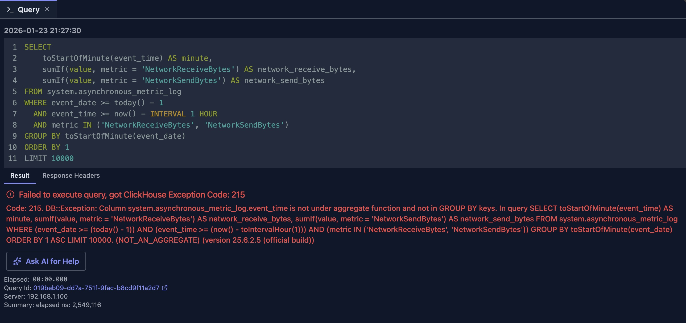
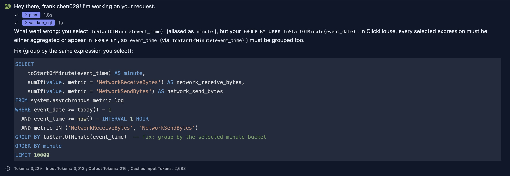

# Ask AI for Help

The "Ask AI for Help" feature provides instant AI-powered assistance when you encounter query errors in the Query Editor. With a single click, you can get explanations of what went wrong and receive suggested fixes for your SQL queries.

## Overview

When a query execution fails, DataStoria automatically displays an "Ask AI for Help" button alongside the error message. This feature leverages AI to:

- **Explain errors**: Understand what went wrong with your query
- **Provide fixes**: Get corrected SQL queries ready to use
- **Save time**: No need to manually research error messages or debug syntax issues

## How It Works

### Automatic Error Detection

The "Ask AI for Help" button appears automatically when:

1. A SQL query execution fails
2. An error message is returned from ClickHouse
3. The error view is displayed in the Query Editor

The button is prominently displayed with a pulsing animation to draw your attention, making it easy to get help when you need it most.



### Getting Help with One Click

With this integration, you no longer need to panic over long error messages from ClickHouse. With one click, AI helps you understand what's wrong, where the error is, and how to fix it.

When the "Ask AI for Help" button is clicked, it automatically starts a new chat session, attaching both the executed SQL query and the error message to get an answer from AI.

In the above example, it would take significant time for a human to pinpoint the error. However, with AI, you can get this error fixed within seconds.



As shown in the response, AI clearly points out where the error is and provides a fix with explanatory comments in the SQL to help you better understand the issue.

Here's a comparison of the wrong and correct versions to help you better understand the error and the fix provided by AI.


```sql
--wrong
GROUP BY toStartOfMinute(event_date)

--correct
GROUP BY toStartOfMinute(event_time)
```

## Integration with Chat Panel

The "Ask AI for Help" feature seamlessly integrates with the global chat panel:

- **Automatic Context**: Your SQL and error are automatically included
- **New Chat Session**: Opens a fresh chat session for focused assistance
- **Follow-up Questions**: You can continue the conversation to refine the solution
- **Query Execution**: Once you receive a corrected query, you can execute it directly from the chat and the query result will be shown below the SQL

## Best Practices

### When to Use

✅ **Use "Ask AI for Help" when:**
- You encounter an error you don't understand
- The error message is unclear or technical
- You need a quick fix for a syntax error
- You want to understand why a query failed

❌ **Consider alternatives when:**
- The error is clearly a connection issue (check your connection settings)
- The error is about permissions (check your user privileges)
- You want to learn SQL fundamentals (use the chat panel for general questions)

### Getting Better Results

1. **Review the Error First**: Try to understand the basic error before asking for help
2. **Provide Context**: If the AI's first suggestion doesn't work, provide more context in follow-up messages
3. **Verify Schema**: Ensure your table and column names are correct before asking
4. **Check Documentation**: For complex ClickHouse-specific features, the AI can reference official documentation

## Limitations

- The AI's suggestions are based on the error message and your SQL query
- Complex errors may require multiple iterations to resolve
- The AI may not have access to your full database schema context
- Some ClickHouse-specific features may need manual verification

## Integration with Other Features

### Natural Language Data Exploration

After receiving a fix from "Ask AI for Help", you can:
1. Execute the corrected query
2. Use the chat panel to explore the results further
3. Ask follow-up questions about the data

### Query Optimization

If your query executes but is slow:
1. Use "Ask AI for Help" to understand performance issues
2. Switch to the Query Optimization feature for detailed analysis
3. Combine both approaches for comprehensive query improvement

## Next Steps

- **[Natural Language Data Exploration](./natural-language-sql.md)** — Generate queries from scratch
- **[Query Optimization](./query-optimization.md)** — Optimize working queries
- **[Error Diagnostics](../03-query-experience/error-diagnostics.md)** — Learn more about understanding errors

