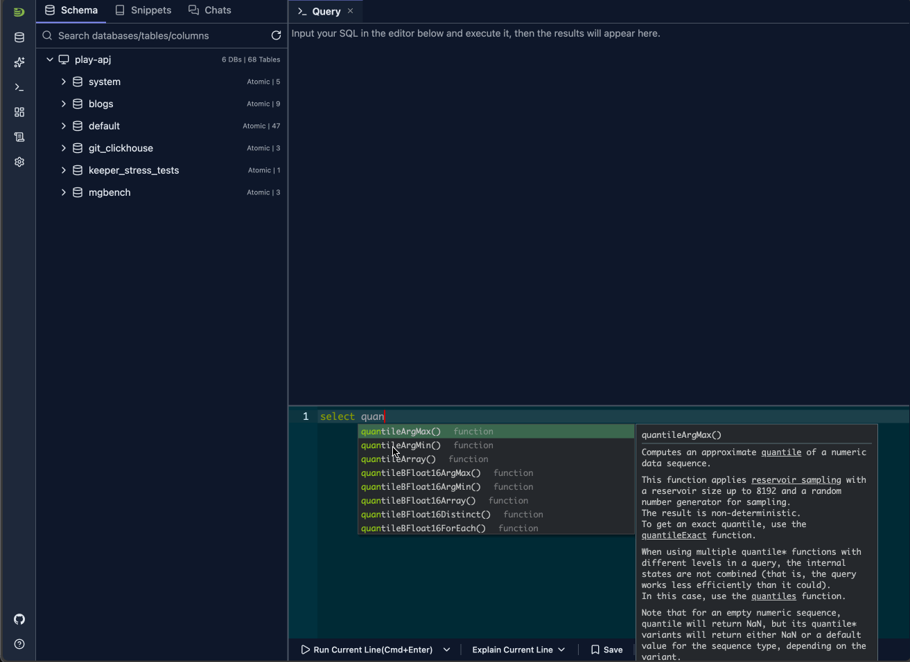
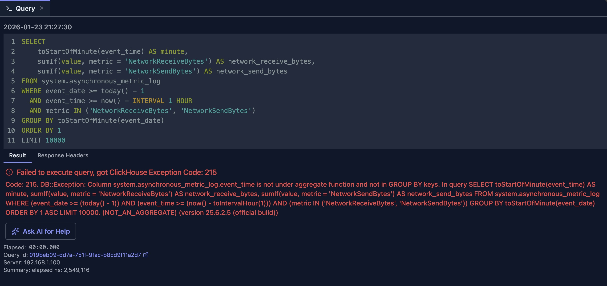
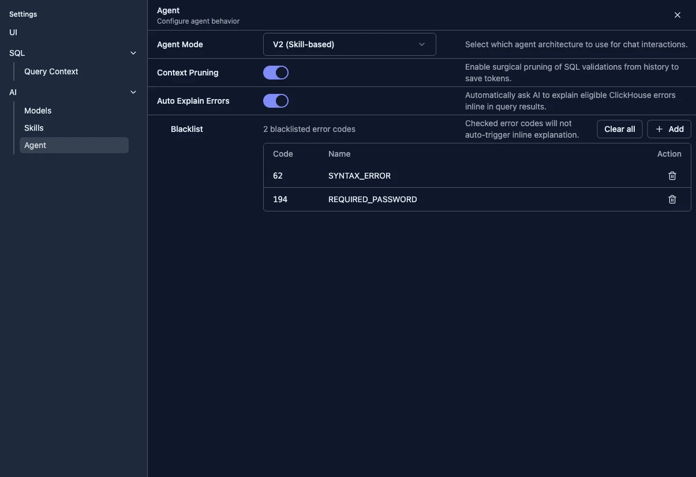
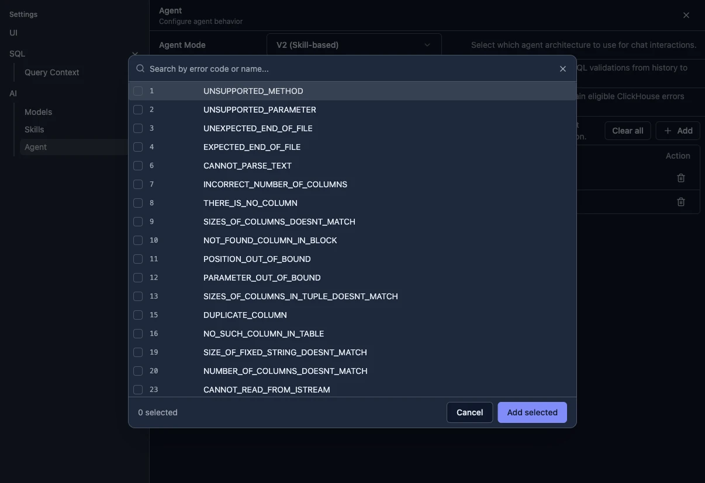

# Ask AI for Help

The "Ask AI for Help" feature provides AI-powered assistance when a query fails in the Query Editor. It can explain what went wrong, suggest likely fixes, and provide corrected SQL examples.

## Overview

DataStoria supports two ways to get help for ClickHouse errors:

- **Automatic inline explanation**: When enabled, eligible ClickHouse errors are explained directly inside the query result view
  
- **Manual help**: You can still click **Ask AI for Fix** to request help on demand

This feature leverages AI to:

- **Explain errors**: Understand what went wrong with your query
- **Provide fixes**: Get corrected SQL queries ready to use
- **Save time**: No need to manually research error messages or debug syntax issues

## How It Works

### Automatic Inline Explanation

If **Auto Explain Errors** is enabled in settings, DataStoria can automatically request an AI explanation when:

1. A query fails with a ClickHouse error code
2. AI models are available
3. The error code is not blacklisted from auto explanation

The explanation is streamed directly inside the error view, below the ClickHouse error details.

The response is intentionally compact and action-focused, usually organized as:

- **Cause**: What failed
- **Fix**: Concrete actions to try
- **Example**: A corrected SQL example when applicable

### Manual Help

Even if automatic explanation is disabled, you can still request help manually.

When a query execution fails, DataStoria can show an **Ask AI for Fix** button alongside the error message. Clicking it sends the SQL query and ClickHouse error details to AI and renders the streamed explanation inline.

This is useful when:

1. Auto explain is disabled
2. The error is blacklisted from automatic explanation
3. You only want AI help for selected failures



In the example above, AI highlights the likely cause and suggests a corrected query much faster than manually inspecting a long ClickHouse exception.

Here is a simplified comparison of the wrong and corrected SQL:

```sql
--wrong
GROUP BY toStartOfMinute(event_date)

--correct
GROUP BY toStartOfMinute(event_time)
```

## Settings

Open **Settings → AI → Agent** to control this feature:



- **Auto Explain Errors**: Enables automatic inline explanations for eligible ClickHouse errors
- **Blacklist**: Prevents selected ClickHouse error codes from auto-triggering AI, while still allowing manual help

Use the blacklist when some error codes are too noisy, too obvious, or not useful for automatic diagnosis.

Use **Add** in the blacklist section to search ClickHouse error codes and select the ones that should stay manual-only:



## Best Practices

### When to Use

✅ **Use automatic or manual AI help when:**
- You encounter an error you don't understand
- The error message is unclear or technical
- You need a quick fix for a syntax error
- You want to understand why a query failed

❌ **Consider alternatives when:**
- The error is clearly a connection issue (check your connection settings)
- The error is about permissions (check your user privileges)
- You want broader SQL learning or exploration (use the chat panel for general questions)

### Getting Better Results

1. **Review the ClickHouse error first**: The inline explanation is best when the original error is meaningful
2. **Verify schema names**: Confirm table and column names when possible
3. **Use manual help selectively**: Blacklist noisy codes and ask manually only when needed
4. **Validate the fix**: AI suggestions are helpful, but you should still verify the corrected query

## Limitations

- Automatic explanation only applies to eligible ClickHouse errors
- The AI's suggestions are based on the error message and your SQL query
- Complex errors may require multiple iterations to resolve
- The AI may not have access to your full database schema context
- Some ClickHouse-specific features still need manual verification

## Integration with Other Features

### Query Optimization

If your query executes but is slow:
1. Use AI help to understand obvious query issues
2. Switch to the Query Optimization feature for detailed analysis
3. Combine both for a more complete workflow

## Next Steps

- **[Slash Commands](./slash-commands.md)** — Trigger AI workflows directly from the chat input using `/explain_error_code` and other commands
- **[Natural Language Data Exploration](./natural-language-sql.md)** — Generate queries from scratch
- **[Query Optimization](./query-optimization.md)** — Optimize working queries
- **[Error Diagnostics](../03-query-experience/error-diagnostics.md)** — Learn more about understanding errors
