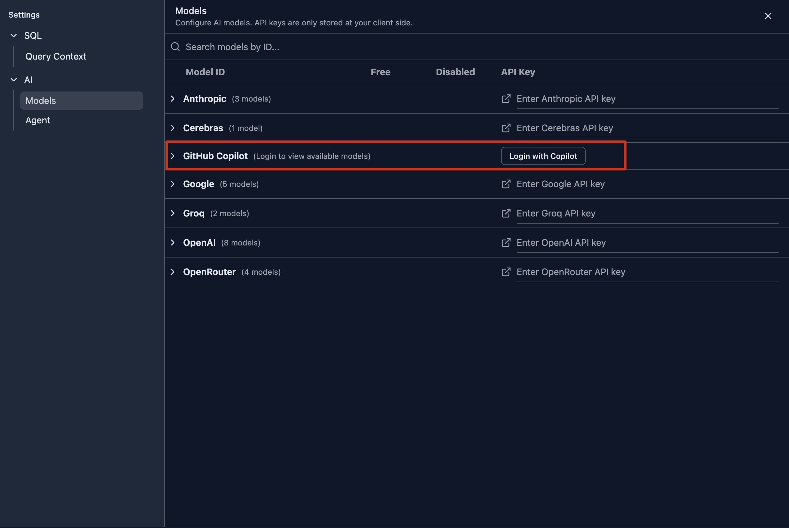
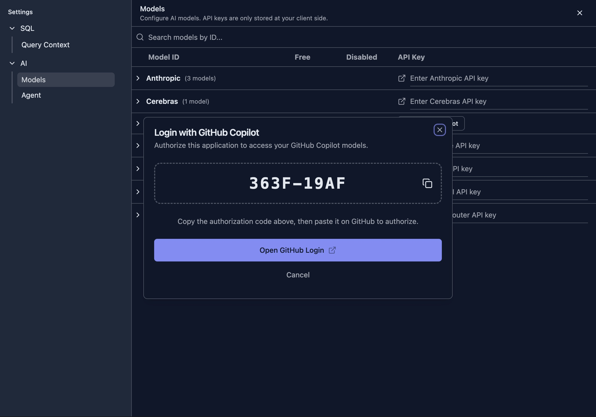
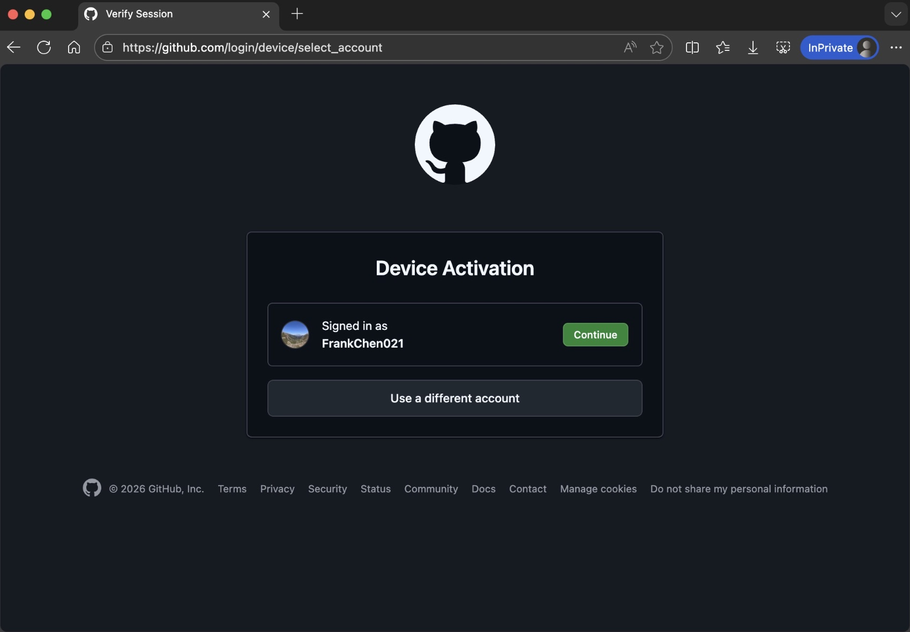
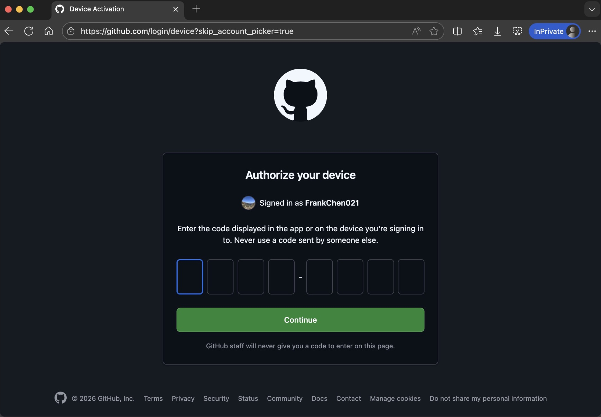
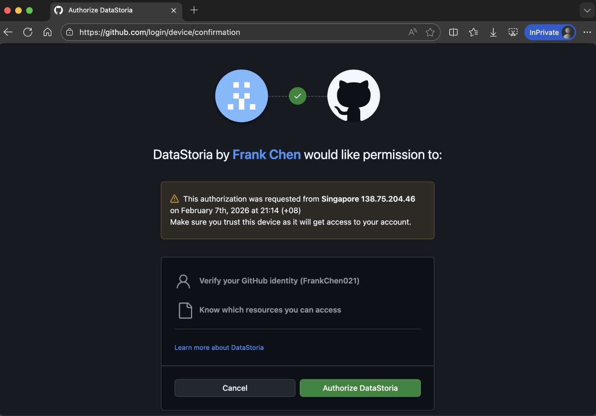
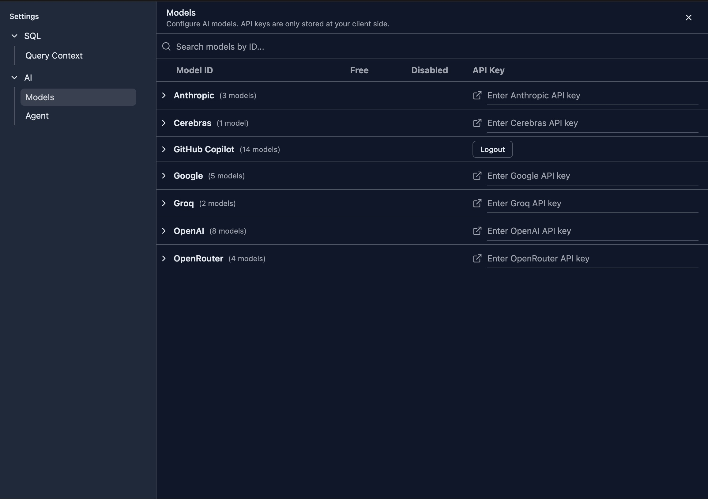

# GitHub Copilot Integration

DataStoria supports GitHub Copilot as an AI provider for chat, query assistance, and other AI-powered features, letting you use your own Copilot subscription across the full AI experience.

## GitHub Copilot Authentication

GitHub Copilot authentication uses the GitHub device authorization flow to link your DataStoria session with your GitHub account. DataStoria shows a short code, you sign in at GitHub’s verification page on any browser, and GitHub returns a token after approval. This is the same flow used by Copilot plugins in tools like VS Code and IntelliJ. For details, see [GitHub device flow](https://docs.github.com/en/apps/oauth-apps/building-oauth-apps/authorizing-oauth-apps#device-flow).

Key points:

- You control access through your GitHub account
- Tokens are stored locally in the browser
- You can revoke access at any time in GitHub settings

### Log in

Open the settings page from the sidebar and choose **AI / Models**. You will see the GitHub Copilot login button.

### Authenticate with GitHub

After clicking the **Login with Copilot** button, a dialog opens showing the verification code you need to enter at GitHub.

Copy the verification code and click **Open GitHub Login** to open the GitHub authentication page.

Click **Continue** on GitHub to enter the verification code.

Paste the verification code and click **Continue**.
GitHub will ask you for final approval of authentication.

After clicking **Authorize DataStoria**, you complete authentication on GitHub. Return to DataStoria and you will see Copilot logged in with available models listed.

### Log out

Once you log in, the access token and refresh tokens are kept locally in your browser, not on the server. You can click **Logout** in the model settings at any time to delete these tokens from your device.

### Note
GitHub uses access and refresh tokens. The access token is short-lived and is refreshed periodically by the refresh token while the DataStoria web app remains open in your browser.

If both tokens expire, you will need to log in again.

## Select a GitHub Copilot Model
If your GitHub organization or plan grants access to multiple Copilot models, you can choose the model that best fits your workload.

The models provided by GitHub Copilot are dynamic. GitHub regularly retires older models and may bring new ones online. The models listed in the web application are always the latest. To learn more, visit the [GitHub supported models](https://docs.github.com/en/copilot/reference/ai-models/supported-models) page.

GitHub may also offer `free` models that are not billed for usage on eligible Copilot plans. See the **Model multipliers** section on the same page to understand how requests are billed.

These models are marked as `Free` in the model selector for quick identification. This is only a guide, and billing always follows GitHub’s documentation.

## Next Step

Learn how to configure AI providers and manage your model list:

- [AI Model Configuration](./ai-model-configuration.md)
