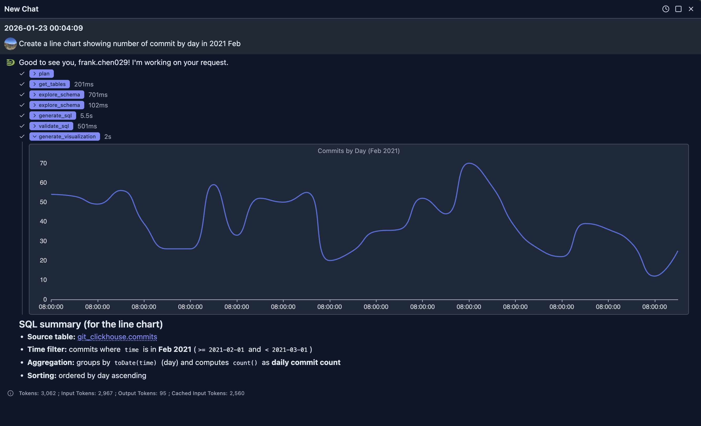
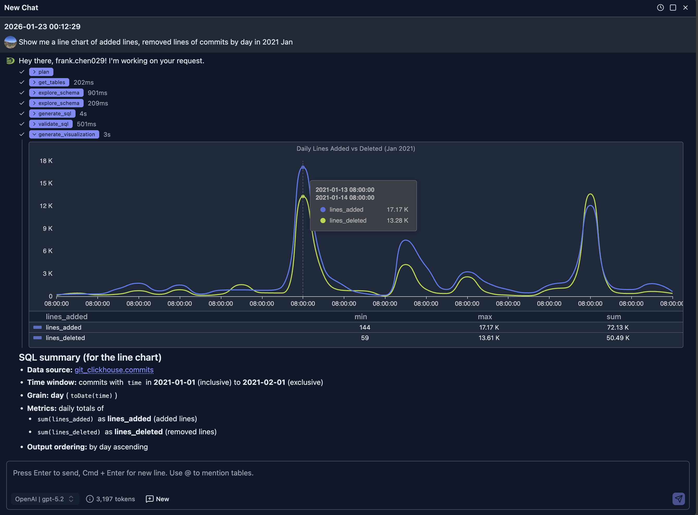
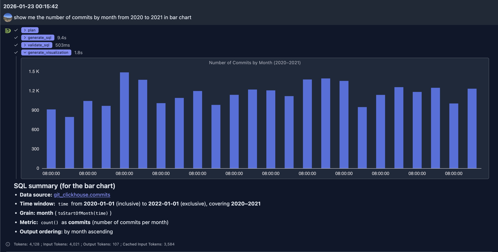
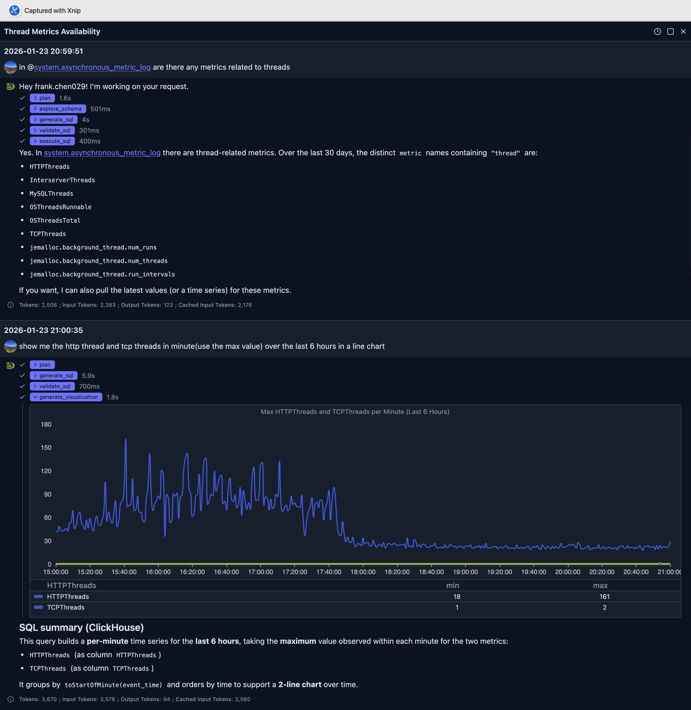

# Intelligent Visualization

DataStoria's Intelligent Visualization feature allows you to generate stunning visualizations like time series, pie charts, and data tables with simple prompts. Transform your query results into visual insights instantly.

It's an extension of data exploration which greatly saves times to know your data.

## Overview

The Intelligent Visualization feature uses AI to:
- Generate a SQL to meet your need
- Generate visualizations automatically

It does NOT fetch data from your local and sends data to LLM for visualization. Instead, LLM generates the SQL for visualization and visualization UI spec together, it's your client that fetch data and renders data in the browser. This saves lots of token compared to the LLM side visualization output.

> **Note**: Visualizations are generated from query results. Learn more about [query execution](../03-query-experience/query-execution.md).

## Generating Charts from Prompts

The [ClickHouse Playground](https://play.clickhouse.com) is used for these example illustration.
You create a connection to this playground to try the following examples.

### Time Series Charts

**Prompt**: "Create a line chart showing number of commit by day in 2021 Feb"



The generated is as:

```sql
SELECT
  toDate(time) AS day,
  count() AS commits
FROM git_clickhouse.commits
WHERE time >= toDateTime('2021-02-01 00:00:00')
  AND time < toDateTime('2021-03-01 00:00:00')
GROUP BY day
ORDER BY day
LIMIT 1000
```

**Prompt**: "Show me a line chart of added lines, removed lines of commits by day in 2021 Jan"




### Bar Charts

**Prompt**: "show me the number of commits by month from 2020 to 2021 in bar chart"




#### Pie Charts

**Prompt**: "Show me a pie chart of market share by product category"

**Result**: A pie chart with each slice representing a product category's market share

**Prompt**: "Create a donut chart showing the distribution of order statuses"

**Result**: A donut chart with different segments for each order status

### Other charts

More charts will be added in near future.

## Best Practices

### Choosing the Right Chart Type

1. **Time Series Data**: Use line or area charts
2. **Categories**: Use bar or column charts
3. **Proportions**: Use pie or donut charts
4. **Relationships**: Use scatter or bubble charts
5. **Distributions**: Use histograms or box plots

### Writing Effective Visualization Prompts

1. **Be Specific**: Mention chart type, and data to include
   - ✅ Good: "Create a line chart with by day and revenue on y-axis, grouped by product category"
   - ❌ Vague: "Show me a chart"

2. **Specify Time Ranges**: Include date ranges for time series
   - ✅ Good: "Show monthly sales from January to December 2024"
   - ❌ Less clear: "Show sales"

3. **Mention Aggregations**: Specify how data should be aggregated
   - ✅ Good: "Bar chart showing average order value by region"
   - ❌ Ambiguous: "Show orders by region"

4. **Request Multiple Series**: Ask for comparisons when needed
   - ✅ Good: "Compare this year's revenue vs last year's on the same chart"
   - ❌ Single series: "Show revenue"

5. **Start New Sessions for Unrelated Questions**:
   - ✅ Good: Start a new chat session when your question is unrelated to previous questions and answers. This prevents context bloat and saves tokens.


## Show Case

The visualization is an extension to previous SQL-based data exploration, it provides visual insight to the data and help us understand the data better.

### ClickHouse Performance Monitoring

ClickHouse itself contains many system tables providing thousands of metrics. Even for experts, building dashboards from these metrics is time-consuming. It's unrealistic to build dashboards for all metrics, and even if we could, finding the right dashboard panels from so many metrics would be challenging.

With AI, we can use multiple rounds of chats to identify the metrics we care about in a particular case and generate visualization panels quickly to address problems.



In above question, we first ask the AI to see if there're any metric related to threads in the *system.asynchronous_metric_log* table.

It generates a SQL as follow to find the answer:

```sql
SELECT DISTINCT metric
FROM system.asynchronous_metric_log
WHERE event_date >= today() - 30
  AND metric ILIKE '%thread%'
ORDER BY metric
LIMIT 500
```

And show us the result. Based on the result, another follow up question is submitted to ask visualization about http threads and tcp threads.

It finishes the job less than 10 seconds to generate SQL and final visualization spec to render at the browser side.

The final SQL used for visualization from the LLM is as:

```sql
SELECT
    toStartOfMinute(event_time) AS ts,
    maxIf(value, metric = 'HTTPThreads') AS HTTPThreads,
    maxIf(value, metric = 'TCPThreads') AS TCPThreads
FROM system.asynchronous_metric_log
WHERE event_date >= today() - 1
  AND event_time >= now() - INTERVAL 6 HOUR
  AND metric IN ('HTTPThreads', 'TCPThreads')
GROUP BY ts
ORDER BY ts
LIMIT 10000
```

From the line chart we can see that the number of HTTP connections per minute before 6PM is much higher than it's after 6PM which implies that the system is a little busy.

## Integration with Other Features

### Natural Language Data Exploration

1. Generate a query using Natural Language Data Exploration
2. Execute the query
3. Request visualization of the results
4. The AI understands the query context for better visualizations

### Query Optimization

Visualize query performance improvements:
1. Run original and optimized queries
2. Create side-by-side visualizations
3. Compare performance metrics visually


## Limitations

- Chart quality depends on query result structure
- Very large datasets may need aggregation before visualization
- Some complex visualizations may require manual refinement
- Custom styling options may vary by chart type

## Next Steps

- **[Natural Language Data Exploration](./natural-language-sql.md)** — Generate queries to visualize
- **[Query Optimization](./query-optimization.md)** — Optimize queries before visualizing
- **[Node Dashboard](../04-cluster-management/node-dashboard.md)** — Monitor individual node performance
- **[Cluster Dashboard](../04-cluster-management/cluster-dashboard.md)** — Monitor cluster-wide metrics

