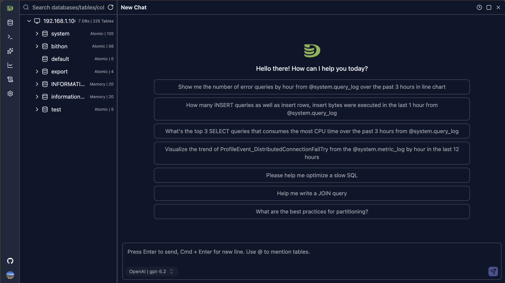
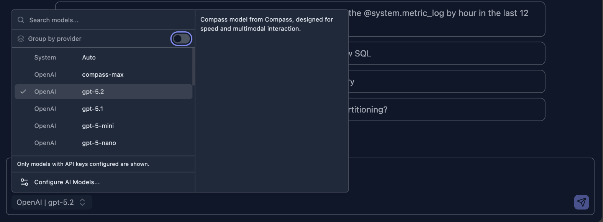
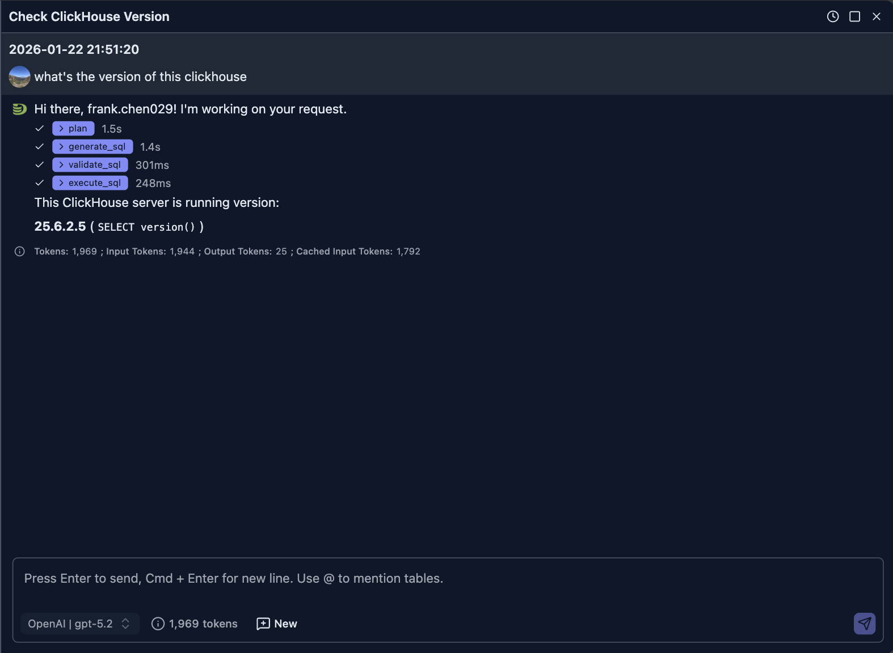
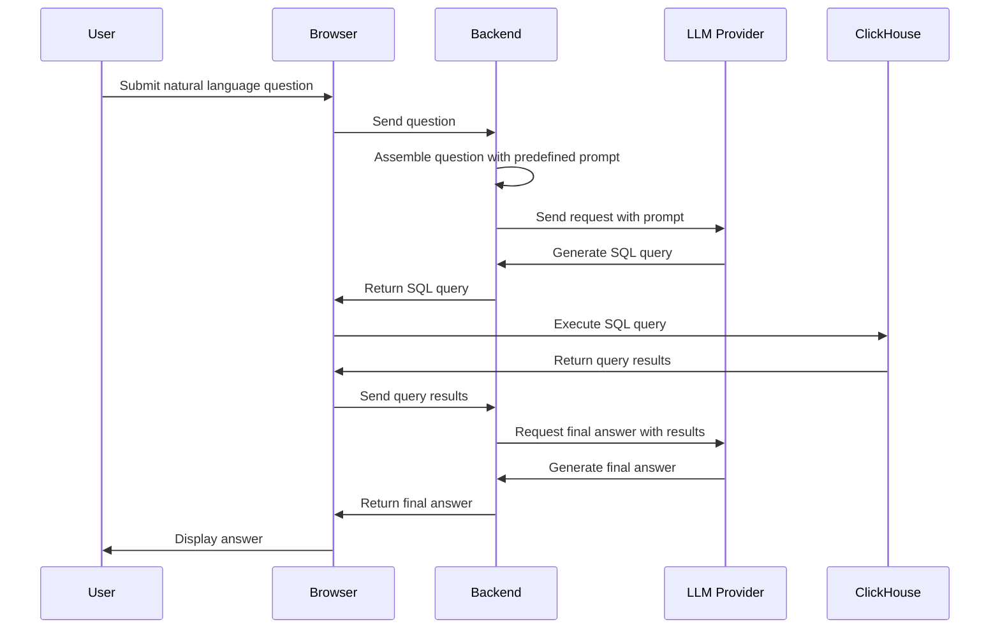
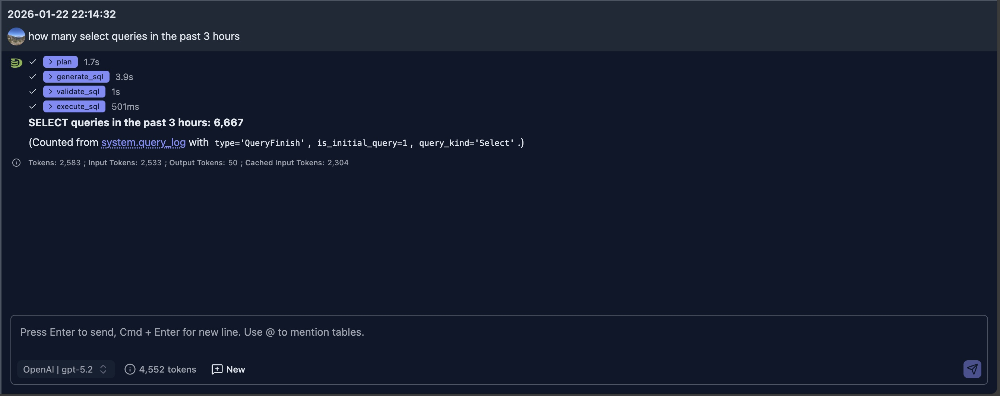
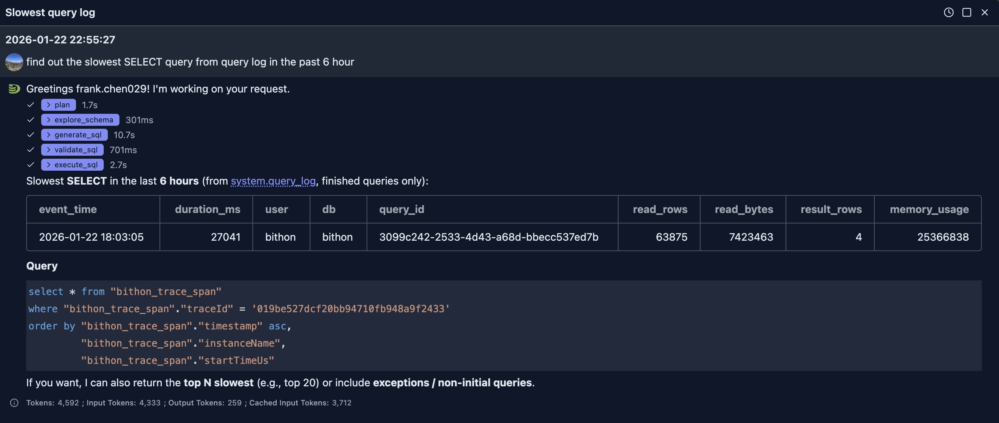
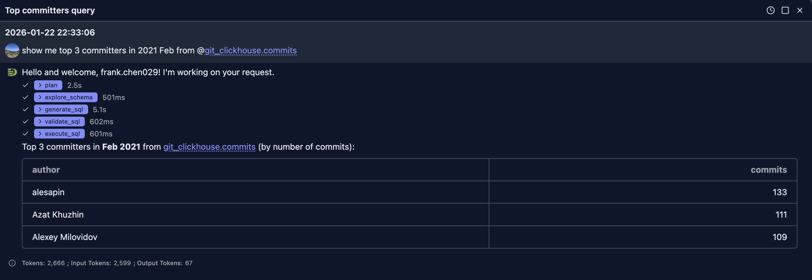
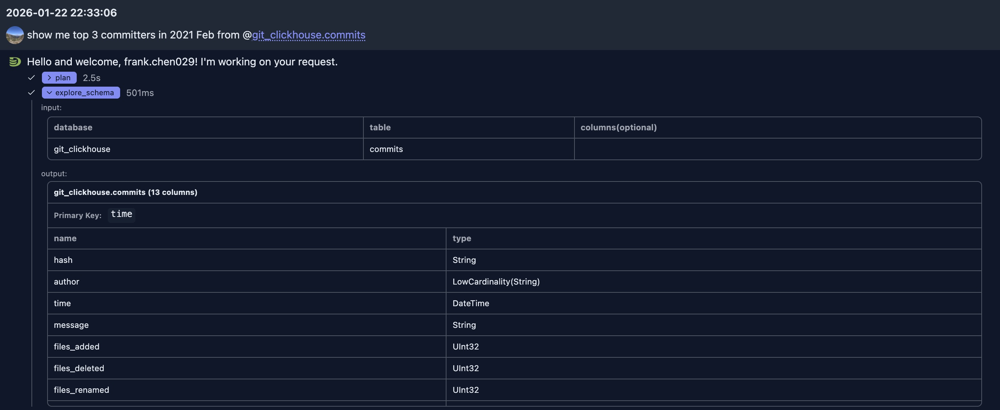
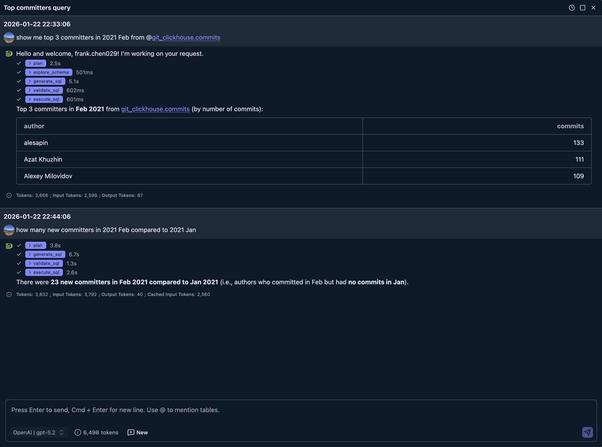

# Natural Language Data Exploration

DataStoria's Natural Language Data Exploration feature allows you to describe your data needs in plain English and receive optimized ClickHouse queries instantly. No need to remember complex SQL syntax—just ask questions naturally.

## Overview

The Natural Language Data Exploration feature uses advanced AI models to understand your intent and generate accurate ClickHouse SQL queries. It analyzes your database schema, understands context, and produces queries that are both syntactically correct and optimized for performance.

## How to Use

### Accessing the Feature

1. **Open the Chat Interface**: Click the chat icon in the sidebar to open a chat tab


The panel provides several example questions for your to quick start with.

2. Choose a model from the model selection list in the INPUT region


1. **Type Your Question**: Describe what you want to know about your data in natural language in the INPUT

2. **Submit Your Questions**: Click the send button to submit your question or just press ENTER to submit the question. The AI will generate a response based on your question

3. **Execute or Refine**: You can execute the query directly or ask for modifications

### Examples

Let's send a question to ask for the ClickHouse version of current running server.

> What's the version of this ClickHouse

The following screenshot shows what the AI answers:



### How it works

When the question is submitted, 

1. The front end will send your question along with your selected model to the backend server
2. The backend will assembly your question with some predefined prompt and send request to the selected model for response
3. The AI will generate a SQL to query the version of ClickHouse
4. This SQL will be sent to your browser side, your browser will then sends the query to your ClickHouse to execute the SQL
5. When the SQL execution finishes, the browser will then send the query result to LLM(via the backend server) for final answer

The following sequence diagram illustrates this process:



You can exand steps on the UI to learn the output of LLM more. For example, in this case, the generated SQL is

```sql
SELECT version() AS clickhouse_version LIMIT 1
```

> NOTE: 
> 
> The generated SQL can be different for the SAME question even under the SAME model.
>

## Use Case

Using the natural languages to ask for data saves our time to write some complex queries. Here're some of use cases where it helps.

### Use Case 1 - ClickHouse Server Performance Diagnostics

We can use the natural language to help us find out data from system tables for problem diagnostics.

> NOTE:
> 
> To do so, your dateabase user name must have been granted access to these *system.\** tables.
> 
> If you don't have priviledges, you can contact your administrator for help.

#### Example 1 - Count select queries over a period

**User Question:** how many select queries in the past 3 hours



The generated SQL for query is as:

```sql
SELECT count() AS select_queries_last_3h
FROM system.query_log
WHERE event_date >= toDate(now() - INTERVAL 3 HOUR)
  AND event_time >= now() - INTERVAL 3 HOUR
  AND type = 'QueryFinish'
  AND is_initial_query = 1
  AND query_kind = 'Select'
SETTINGS log_queries = 1
```

#### Example 2 - Find out slowest query

**Question:** find out the slowest SELECT query from query log in the past 6 hour



### Use Case 2 - Business Analytics  

In this example, we will use [ClickHouse Playground](https://play.clickhouse.com)'s git_clickhouse.commits table for illustration. 

You can configure the playground connection in your DataStoria to try the following similar questions.

**Question 1:** show me top 3 committers in 2021 Feb from @git_clickhouse.commits



In this example, since LLM does not know the table structure, it first uses the èxplore_schema` tool to check the table structure to decide which columns will be used for the SQL. We can expand the tool to see its input and output.



After it knows the schema, it uses 'author' column as the 'committer' in our question. The generated SQL is as:

```sql
SELECT
  author,
  count() AS commits
FROM git_clickhouse.commits
WHERE time >= toDateTime('2021-02-01 00:00:00')
  AND time < toDateTime('2021-03-01 00:00:00')
GROUP BY author
ORDER BY commits DESC, author ASC
LIMIT 3
```

Once the response is returned to LLM, it outputs the result in table format.

> NOTE:
> 
> LLM does not always use table format to show the result, it depends on your request and the data returned to LLM
> 

**Question 2:** How many new committers in 2021 Feb compared to 2021 Jan

This question is a follow up question to above one in the SAME chat session, so we don't tell the LLM which table it should. The LLM is able to infer that it should query the SAME table.
And the table schema information is already in the context, the LLM does not need to ask for table information again, but directly genrates a SQL that meets the need.



And it generates a little bit complicated SQLs this time using CTE

```sql
WITH
  jan_authors AS (
    SELECT DISTINCT author
    FROM git_clickhouse.commits
    WHERE time >= toDateTime('2021-01-01 00:00:00')
      AND time <  toDateTime('2021-02-01 00:00:00')
  ),
  feb_authors AS (
    SELECT DISTINCT author
    FROM git_clickhouse.commits
    WHERE time >= toDateTime('2021-02-01 00:00:00')
      AND time <  toDateTime('2021-03-01 00:00:00')
  )
SELECT
  '2021-02 vs 2021-01' AS period,
  count() AS new_committers_in_feb
FROM feb_authors
WHERE author NOT IN (SELECT author FROM jan_authors)
LIMIT 1
```

It took less 15 seconds to get the answer (from generation to execution and to final answer), which is much faster than our human being.

## Best Practices

### Writing Effective Prompts

1. **Be Specific**: Include relevant details like time ranges, filters, and aggregations
   - ✅ Good: "Show me daily active users for the last 7 days, grouped by country"
   - ❌ Vague: "Show me users"

2. **Mention Table Names**: If you know the table, mention specific tables or columns
   - ✅ Good: "Get the average order value from the orders table for customers in the US"
   - ❌ Less clear: "Get average orders"

3. **Specify Aggregations**: Clearly state what calculations you need
   - ✅ Good: "Calculate the total revenue and average order size by month"
   - ❌ Ambiguous: "Show me revenue"

4. **Include Time Ranges**: Be explicit about date ranges and time periods
   - ✅ Good: "Show me sales from January 1st to March 31st, 2024"
   - ❌ Unclear: "Show me sales"

### Refining Generated Queries

If the initial query doesn't match your needs:

1. **Ask for Modifications**: "Can you add a filter for status = 'active'?"
2. **Request Different Aggregations**: "Instead of sum, use average"
3. **Change the Time Range**: "Make it last 90 days instead of 30"
4. **Adjust Sorting**: "Sort by date ascending instead of descending"

### Understanding Schema Context

The AI automatically uses your database schema to:
- Validate table and column names
- Suggest appropriate data types
- Recommend efficient query patterns
- Apply ClickHouse-specific optimizations

## Tips for Better Results

1. **Start Simple**: Begin with straightforward queries and add complexity gradually
2. **Review Before Executing**: Always review generated queries, especially for write operations
3. **Use Follow-up Questions**: Build on previous queries with contextual follow-ups
4. **Leverage Schema Information**: The AI knows your schema—use table and column names naturally
5. **Iterate**: Don't hesitate to refine queries multiple times to get exactly what you need

## Limitations

- The AI generates queries based on your schema, but may not know all business logic
- Complex multi-step operations might require manual SQL refinement
- Very large or complex queries may need optimization after generation
- Always verify queries before running on production data

## Privacy and Security

- Your natural language prompts are sent to the LLM provider you configure
- Generated queries are executed directly from your browser to ClickHouse, NOT at the server side
- No query results are sent to external services
- See [AI Model Configuration](./ai-model-configuration.md) for privacy details

## Next Steps

- **[Query Optimization](./query-optimization.md)** — Learn how AI can help optimize your queries
- **[Intelligent Visualization](./intelligent-visualization.md)** — Generate charts from natural language
- **[AI Model Configuration](./ai-model-configuration.md)** — Set up your LLM provider API keys

