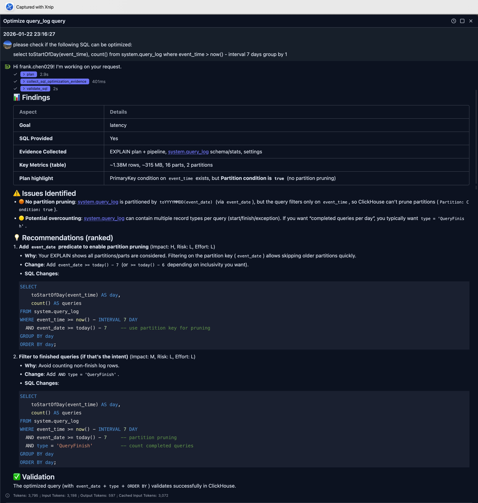
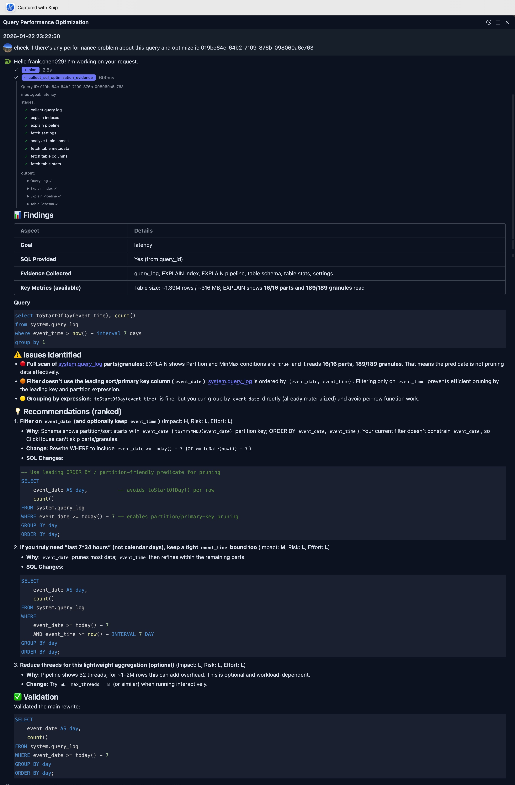

# Query Optimization

DataStoria's Smart Query Optimization feature uses AI to analyze your queries based on evidence and provides actionable performance improvements. Get expert-level optimization suggestions without deep ClickHouse expertise.

## Overview

The Query Optimization feature analyzes your SQL queries and suggests improvements based on:
- ClickHouse best practices
- Your database schema and indexes
- Query execution patterns
- Performance metrics and evidence

## Use Cases

The Query Optimization feature supports three flexible ways to identify queries for optimization:

### 1. Provide SQL Query Directly

You can paste or write a SQL query directly for optimization. This is ideal when:
- You have a specific query you want to optimize
- You're writing a new query and want to ensure it's optimized from the start
- You've copied a query from another source

**Example**: Simply paste your SQL query and ask "Optimize this query" or "How can I improve this query's performance?"

```text
please check if the following SQL can be optimized:

select toStartOfDay(event_time), count() 
from system.query_log
where event_time > now() - interval 7 days group by 1
```

The LLM is able to extract SQLs from the request and starts the analysis and then gives suggestions based on evidences.



In this example, the LLM points out a key improvement which leverage the partition pruning by just add an extra filter to the SQL.

```sql
SELECT
    toStartOfDay(event_time) AS day,
    count() AS queries
FROM system.query_log
WHERE event_time >= now() - INTERVAL 7 DAY
  AND event_date >= today() - 7     -- use partition key for pruning
GROUP BY day
ORDER BY day;
```

### 2. Provide Query ID

> NOTE
> 
> To use this feature, your database user MUST have the priviledge on *system.query_log* table.
> If you don't have, please ask your administrator to grant.


If you have a `query_id` from ClickHouse's query log, you can provide it directly. This is useful when:
- You've identified a slow query from the query log
- You want to optimize a query that was recently executed
- You're working with queries tracked in ClickHouse's system tables

**Example**: "Optimize query with query_id: abc123-def456-ghi789"

In the example illustrated in the following picture, we use above SQL again, but we first execute it and get the query id, and ask LLM. The example below sent the question as:

```text
check if there's any performance problem about this query and optimize it: 019be64c-64b2-7109-876b-098060a6c763
```

The application will automatically retrieve the query from query log and collect necessary information for optimization suggestion.

The full response is as:



### 3. Automatically Discover Expensive Queries

> NOTE:
> 
> To use this feature, your database user MUST have the priviledge on *system.query_log* table.
> If you don't have, please ask your administrator to grant.


The feature can automatically find and analyze expensive queries based on performance metrics. This is perfect when:
- You want to identify the slowest queries in your system
- You need to find queries consuming the most resources
- You're doing a performance audit

**Supported Metrics**:
- **CPU**: Find queries with highest CPU usage
- **Memory**: Find queries consuming the most RAM
- **Duration**: Find the slowest/longest-running queries
- **Disk**: Find queries with highest I/O or storage usage

**Example Requests**:
- "Find the top 5 queries by CPU and optimize them"
- "What queries are consuming the most memory?"
- "Find the slowest queries from the last hour and analyze them"
- "Optimize queries with highest disk usage"

You can also specify time ranges:
- Relative time: "last hour", "past 30 minutes", "last 2 hours"
- Absolute time: "between 2025-01-01 and 2025-02-01", "on January 15th"

**Note**: Discovery mode supports filtering by CPU, memory, disk, and duration metrics only. For other filters (user, database, table name, query pattern), provide a specific query_id or SQL query directly.

## How It Works

### Understanding AI Recommendations

When you submit a query for optimization, the AI:

1. **Analyzes Query Structure**: Examines joins, aggregations, filters, and data access patterns
2. **Reviews Schema Context**: Considers table structures(including primary key, partition by expression), indexes, and data types
3. **Collect Evidence**: Collect index usage, execution pipeline, table size etc
4. **Identifies Bottlenecks**: Finds inefficient patterns like full table scans, unnecessary joins, or suboptimal aggregations
5. **Suggests Improvements**: Provides specific, actionable recommendations with explanations

You can expand the 'collect_sql_optimization_evidence' step to find out more.

## Limitations

- Optimizations are suggestions based on best practices, not guarantees
- Actual performance may vary based on data distribution and hardware
- Some optimizations may require schema changes (indexes, materialized views)
- Complex optimizations may need manual refinement

## Integration with Other Features

### Natural Language Data Exploration

Queries generated from natural language are automatically optimized(with some rules in the system prompts), but you can request additional optimization passes.

### Query Log Inspector

Use query log data to identify queries that would benefit most from optimization:
1. Find slow queries in the log
2. Request optimization for those queries
3. Monitor improvements over time

> **Pro tip**: Use [Query Log Inspector](../03-query-experience/query-log-inspector.md) to identify slow queries that need optimization.

## Next Steps

- **[Intelligent Visualization](./intelligent-visualization.md)** — Generate visualizations from your optimized queries
- **[Query Explain](../03-query-experience/query-explain.md)** — Understand query execution plans

