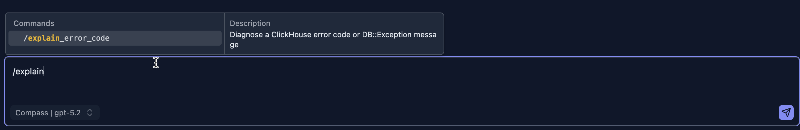

# Slash Commands

Slash commands let you invoke specialized AI workflows directly from the chat input. Instead of writing a full prompt, type `/` to browse available commands, select one, and let the AI follow a precise workflow tailored for that task.



## How It Works

1. Click the chat input and type `/`.
2. A command palette opens, showing all available commands with descriptions.
3. Use the arrow keys or mouse to select a command, then press **Enter**.
4. Add any relevant details after the command name (error message, SQL, etc.).
5. Press **Cmd+Enter** (or **Ctrl+Enter**) to send.

The command is expanded on the server before reaching the AI — you see the original `/command` in the chat history, while the AI receives the full structured prompt.

## Available Commands

### `/explain_error_code`

Diagnoses a ClickHouse error code or `DB::Exception` message using a dedicated error handbook. The AI looks up the exact function signature, setting name, or memory configuration relevant to the error code and provides a targeted fix.

**Usage:**

```
/explain_error_code error code: 42
error message: DB::Exception: Number of arguments for function toDate doesn't match
sql:
SELECT toDate(event_time, 'UTC') FROM events
```

**Supported error codes include:**

| Code | Symbolic Name | Description |
|------|--------------|-------------|
| `42` | `NUMBER_OF_ARGUMENTS_DOESNT_MATCH` | Wrong number of arguments passed to a function |
| `115` | `UNKNOWN_SETTING` | Unrecognized ClickHouse setting name |
| `241` | `MEMORY_LIMIT_EXCEEDED` | Query exceeded a configured memory limit |

For unsupported codes the AI falls back to its general ClickHouse knowledge and provides a best-effort diagnosis.


## Keyboard Reference

| Key | Action |
|-----|--------|
| `/` at the start of input | Open the command palette |
| `↑` / `↓` | Navigate commands |
| `Enter` | Select the highlighted command |
| `Escape` | Close the palette without selecting |
| `Cmd+Enter` / `Ctrl+Enter` | Send the message |

## Next Steps

- **[Ask AI for Help](./ask-ai-for-help.md)** — One-click error assistance from the Query Editor
- **[Agent Skills](./skills.md)** — Understand the skills that slash commands invoke
- **[Error Diagnostics](../03-query-experience/error-diagnostics.md)** — Learn how ClickHouse errors are parsed and displayed
