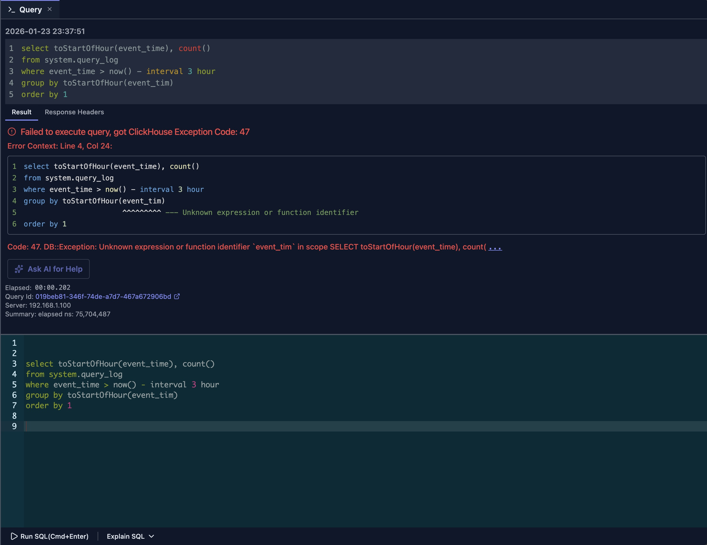

# Error Diagnostics

DataStoria provides built-in error diagnostics to help you quickly identify and resolve SQL query errors. In addition to showing the original ClickHouse error message, it can highlight the exact error location in your SQL and (optionally) let you ask AI for help.

## Overview

When a query fails, DataStoria's error diagnostics system provides:

- **Detailed Error Messages**: The original ClickHouse error message (code, message, and context)
- **Error Location Highlighting**: Inline pointers with line/column context to pinpoint the failing part
- **AI-Powered Fix Suggestions**: A shortcut to “Ask AI for help” when the error is non-obvious

## Error Location Highlighting

ClickHouse error messages can be verbose and time-consuming to act on—especially for syntax and identifier errors in longer queries. To address this, DataStoria parses common ClickHouse error patterns and renders an **inline error pointer** directly inside your SQL, so you can immediately see what needs fixing.

Here's an example:



Instead of only showing a long error message like:

```text
Code: 47. DB::Exception: Unknown expression or function identifier `event_tim` in scope SELECT toStartOfHour(event_time), count() FROM system.query_log WHERE event_time > (now() - toIntervalHour(3)) GROUP BY toStartOfHour(event_tim) ORDER BY 1 ASC. Maybe you meant: ['event_time']. (UNKNOWN_IDENTIFIER) (version 25.6.2.5 (official build))
```

DataStoria pinpoints the error location in the original query and shows it inline:

```sql
select toStartOfHour(event_time), count() 
from system.query_log
where event_time > now() - interval 3 hour
group by toStartOfHour(event_tim)
                       ^^^^^^^^^ --- Unknown expression or function identifier
order by 1
```

With this inline context, you can fix the SQL immediately without scanning the full ClickHouse error text.

> NOTE
>
> Error location highlighting is **not** an AI feature. It does **not** consume tokens.
> 

### Examples

DataStoria supports multiple ClickHouse error patterns. Here are a few additional examples:

```sql
select toStartOfHour(event_time), count() 
from clusters('default', system.query_log)
     ^^^^^^^^ --- Unknown table function clusters.
where event_time > now() - interval 3 hour
group by toStartOfHour(event_tim)
order by 1
```

```sql
select toStartOfHour(event_time), count() 
from cluster('default', system.query_log)
              ^^^^^^^ --- Requested cluster 'default' not found
where event_time > now() - interval 3 hour
group by toStartOfHour(event_tim)
order by 1
```

```sql
select toStartOfHou(event_time), count()
       ^^^^^^^^^^^^ --- Function with name `toStartOfHou` does not exist
from system.query_log
where event_time > now() - interval 3 hour
group by toStartOfHour(event_tim)
```

```sql
select toStartOfHour(event_time), count()
from system.query_log
where event_time > now() - 3 hour
                             ^ --- Syntax error
group by toStartOfHour(event_tim)
order by 1
```

## AI-Powered Fix Suggestions

For errors that require more context (permissions, cluster setup, function usage, performance-related settings, etc.), you can use the integrated AI feature to **Ask AI for help**.

> **Learn more**: See [Ask AI for Help](../02-ai-features/ask-ai-for-help.md) for detailed information about AI-powered error assistance and how to get instant fixes with one click.


## Limitations

- **Heuristic-based**: Error location highlighting is based on pattern analysis. In some cases it may point to the wrong spot. If that happens, please submit an [issue](https://github.com/FrankChen021/datastoria/issues) (ideally with the SQL and the raw ClickHouse error text), or open a PR with a fix.


## Next Steps

- **[Query Execution](./query-execution.md)** — Learn how to execute queries and handle results
- **[SQL Editor](./sql-editor.md)** — Master the SQL editor features
- **[Query Optimization](../02-ai-features/query-optimization.md)** — Optimize queries for better performance

