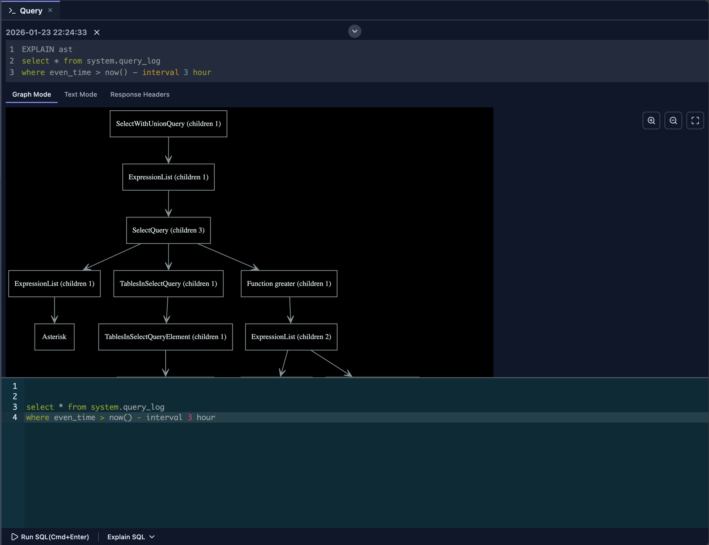
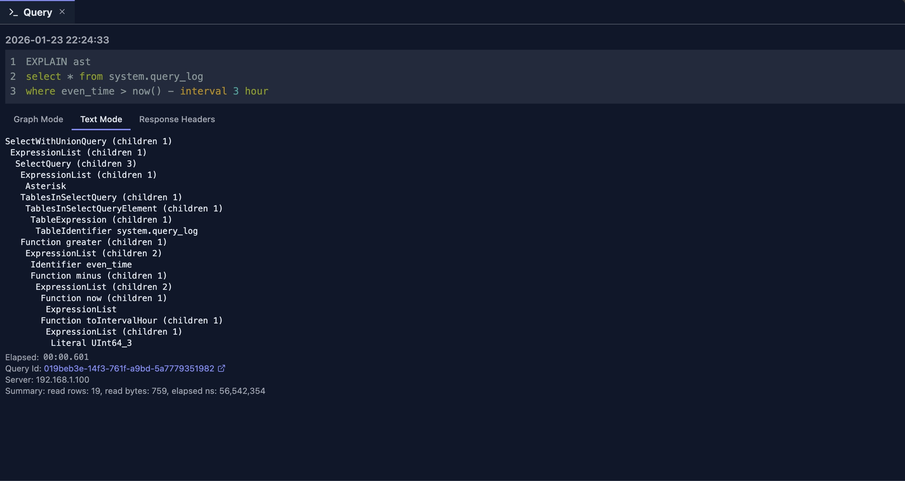
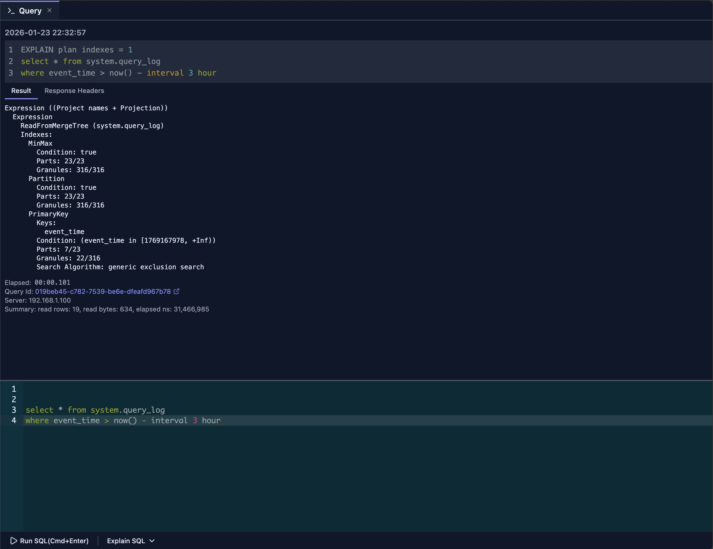
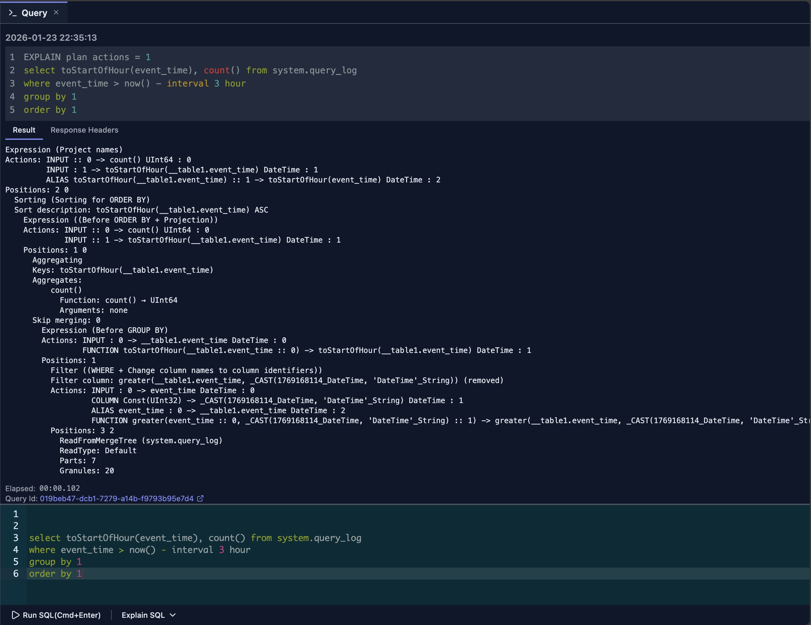
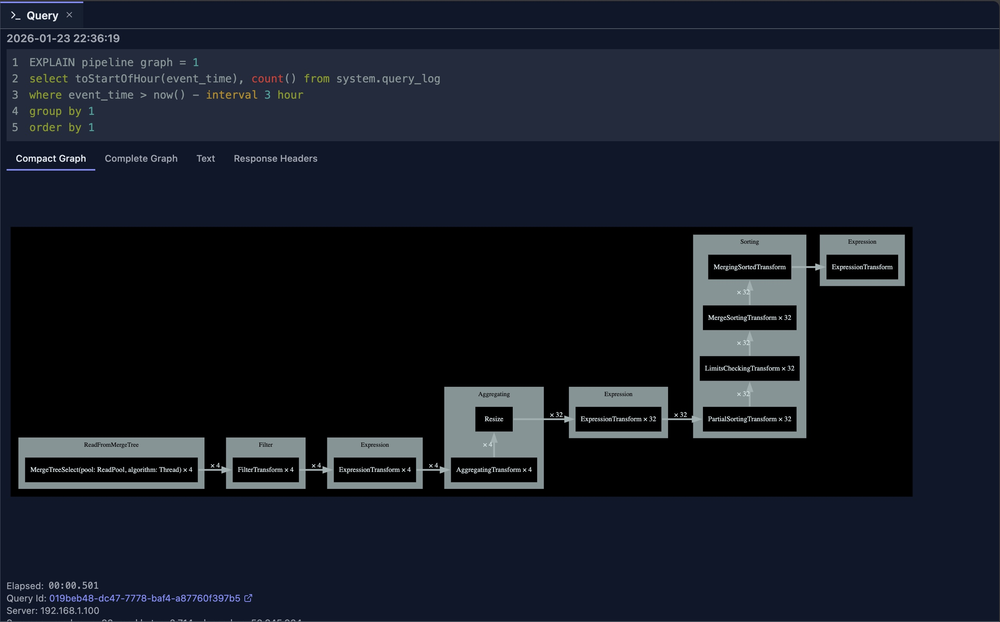
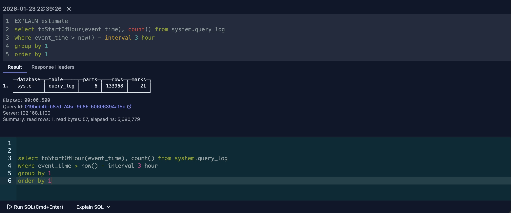

# Query Explain

The Query Explain feature helps you understand how ClickHouse executes your queries by providing detailed execution plans, pipeline visualizations, and abstract syntax tree (AST) representations. This insight is crucial for optimizing query performance and debugging execution issues.

## Overview

Query Explain provides multiple ways to understand query execution:

- **EXPLAIN SYNTAX**: Displays the result of syntax checking
- **EXPLAIN PLAN (Indexes)**: Shows the query execution plan with index usage
- **EXPLAIN PLAN (Actions)**: Shows the logical execution plan with optimization information
- **EXPLAIN PIPELINE**: Visualizes the execution pipeline
- **EXPLAIN AST**: Displays the abstract syntax tree
- **EXPLAIN ESTIMATE**: Provides simplified statistics about data to be read

The feature integrates graphical views to help you understand the results more intuitively.

## How to Use

### Explaining All Text in the Editor

If the editor contains only one SQL statement:

1. Click the **'Explain SQL'** button from the command bar
2. Select the EXPLAIN function you want to execute from the dropdown menu
3. Click the selected option to run the explanation

The system automatically adds the appropriate `EXPLAIN` statement to your query, so you don't need to manually type it.

### Explaining Part of SQL Text

To explain only a portion of your query:

1. Select the text you want to explain in the editor
2. Click the **'Explain SQL'** button from the command bar
3. Choose the EXPLAIN function from the dropdown menu
4. Click to execute

The selected portion will be explained independently of the rest of the query.

> **Note:** You don't need to manually add `EXPLAIN xxxx` to your SQL statements. The editor handles this automatically.

## EXPLAIN AST

`EXPLAIN AST` is primarily a database developer tool that displays the abstract syntax tree (AST) format of your parsed SQL query. By default, DataStoria provides a graphical tree view of the AST, making it easier to understand the query structure.

If you prefer, you can switch to **'Text Mode'** to view the traditional text-based AST output.

### Use Cases

- **Syntax Validation**: Verify that your query is parsed correctly
- **Query Structure Analysis**: Understand how ClickHouse interprets your query
- **Debugging**: Identify parsing issues or unexpected query transformations
- **Learning**: Study how SQL statements are structured internally

## EXPLAIN SYNTAX

`EXPLAIN SYNTAX` is another tool primarily used by database developers. It displays the result of syntax checking, showing how ClickHouse interprets and normalizes your SQL query.

This feature is useful for:
- **Syntax Normalization**: See how ClickHouse normalizes your query syntax
- **Query Transformation**: Understand how your query is transformed internally
- **Syntax Validation**: Verify that your query syntax is correct

For more detailed information, refer to the [ClickHouse official documentation](https://clickhouse.com/docs/en/sql-reference/statements/explain#explain-syntax) on this feature.

## EXPLAIN PLAN (Indexes)

The `EXPLAIN PLAN (Indexes)` feature sends an `EXPLAIN PLAN indexes=1` statement to ClickHouse to analyze how your query leverages:

- **Primary Keys**: How the primary key is used for filtering
- **Partitions**: Whether partition pruning is applied
- **Projections**: If projections are utilized
- **Secondary Indexes**: How secondary indexes are accessed

This is a powerful tool for mastering query optimization and writing highly efficient SQL statements.

### Key Insights

- **Index Usage**: Verify that indexes are being used effectively
- **Partition Pruning**: Check if unnecessary partitions are being skipped
- **Optimization Opportunities**: Identify areas where indexes could improve performance

For more information, refer to the [ClickHouse official documentation](https://clickhouse.com/docs/en/sql-reference/statements/explain#explain-plan) on this statement.

## EXPLAIN PLAN (Actions)

The `EXPLAIN PLAN (Actions)` shows the logical execution plan with detailed information about query optimization, including:

- **Read Order**: Whether data is read in a specific order
- **Filter Pushdown**: How filters are applied during execution
- **Join Strategies**: The join algorithms and order used
- **Aggregation Methods**: How aggregations are performed
- **Sort Operations**: Sorting strategies and locations

### Understanding the Output

This view helps you understand:
- **Execution Flow**: The logical steps ClickHouse will take
- **Optimization Decisions**: How ClickHouse optimizes your query
- **Performance Characteristics**: What operations might be expensive

## EXPLAIN PIPELINE

The `EXPLAIN PIPELINE` shows the execution plan as a visual pipeline diagram. This tool helps you understand:

- **Pipeline Connections**: How different processing stages connect with each other
- **Parallelism**: Which steps can run in parallel
- **Data Flow**: How data moves through the execution pipeline
- **Processing Stages**: The sequence of transformations applied to your data

### Visual Benefits

The graphical representation makes it easier to:
- **Identify Bottlenecks**: Spot stages that might slow down execution
- **Understand Parallelism**: See which operations can run concurrently
- **Optimize Queries**: Make informed decisions about query structure

## EXPLAIN ESTIMATE

The `EXPLAIN ESTIMATE` can be seen as a simplified view of `EXPLAIN PLAN indexes=1`. It provides a concise summary of what your query will read:

- **Data Parts**: Number of data parts to be read
- **Rows**: Estimated number of rows to be processed
- **Marks**: Number of marks (index entries) to be read

> **Performance Tip:** Generally, the smaller these values, the better the query performance.

### When to Use

This simplified view is useful for:
- **Quick Assessment**: Get a fast overview of query complexity
- **Comparison**: Compare different query approaches at a glance
- **Learning**: Understand query resource requirements without detailed analysis

### Limitations

Since it doesn't provide the total number of parts and rows for comparison, the results may sometimes be less insightful than the full `EXPLAIN PLAN (Indexes)` output. Use it as a quick reference, but refer to the detailed plan for comprehensive analysis.

## Best Practices

### Regular Analysis

1. **Explain Before Optimizing**: Always explain queries (especially `EXPLAIN PLAN (Indexes)`) before optimizing
2. **Compare Plans**: Compare plans before and after changes
3. **Monitor Changes**: Track how plan changes affect performance
4. **Document Patterns**: Document common plan patterns

### Optimization Workflow

1. **Run EXPLAIN**: Start with EXPLAIN PLAN or PIPELINE
2. **Identify Issues**: Look for full scans, missing indexes, etc.
3. **Make Changes**: Modify query or add indexes
4. **Re-explain**: Verify improvements in the plan
5. **Test Performance**: Measure actual performance improvement

### Understanding Output

1. **Read Top to Bottom**: Execution flows from top to bottom
2. **Look for Scans**: Full table scans are often the bottleneck
3. **Check Index Usage**: Verify indexes are being used
4. **Examine Joins**: Ensure efficient join strategies

## Limitations

- **Estimates**: Plans show estimates, not actual execution
- **Complexity**: Very complex queries may have complex plans
- **Version Differences**: Plan format may vary by ClickHouse version
- **Real-time**: Plans are generated at explain time, not execution time
- **Visualization Access**: The graphical visualization for `EXPLAIN AST` and `EXPLAIN PIPELINE` is only available when accessed through the **'Explain SQL'** dropdown menu in the command bar. Direct SQL execution of these commands will show text output only.

## Next Steps

- **[Query Optimization](../02-ai-features/query-optimization.md)** — Use AI to optimize your queries
- **[Query Log Inspector](./query-log-inspector.md)** — Analyze actual query performance

