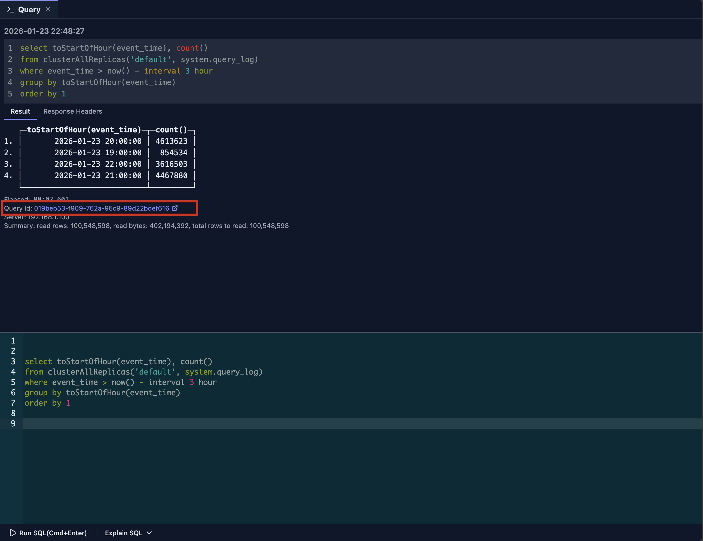
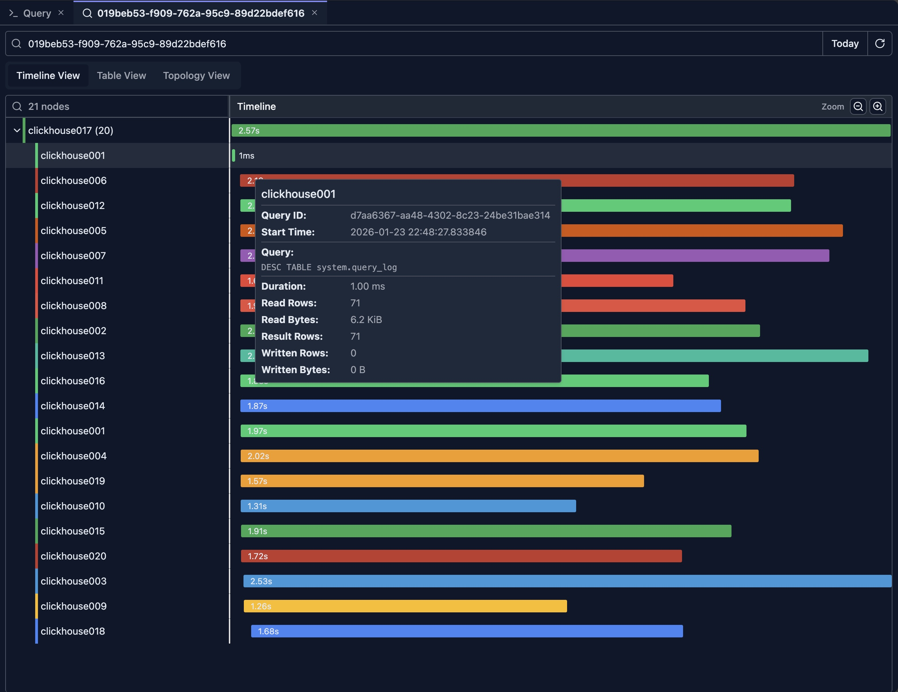
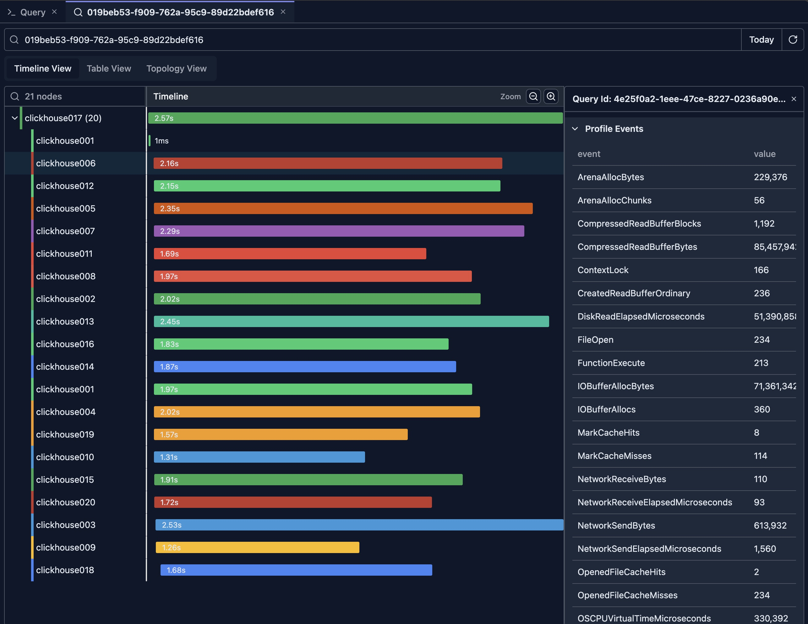
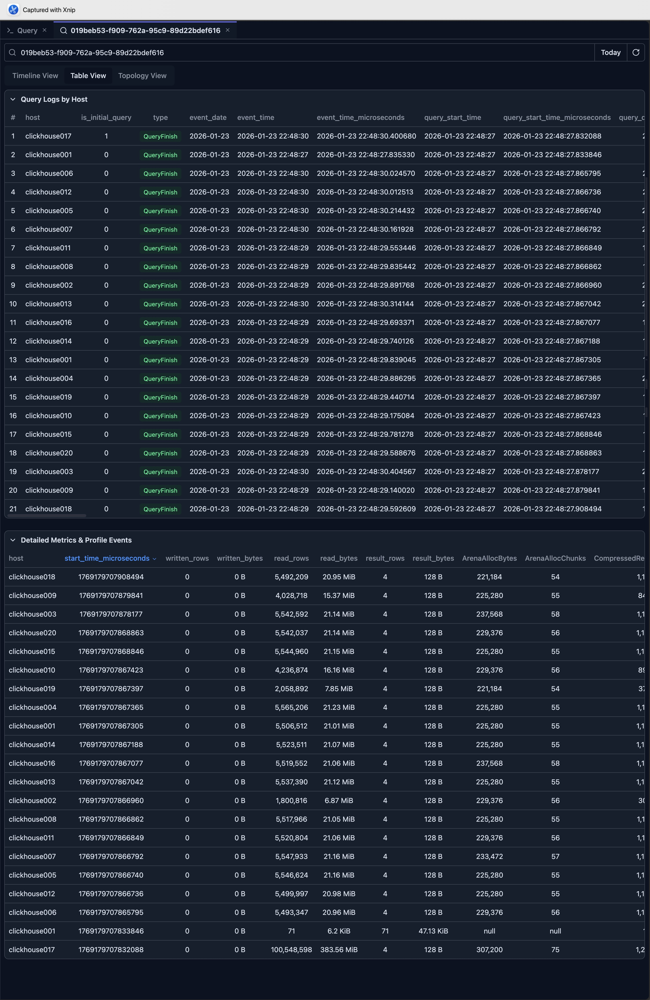
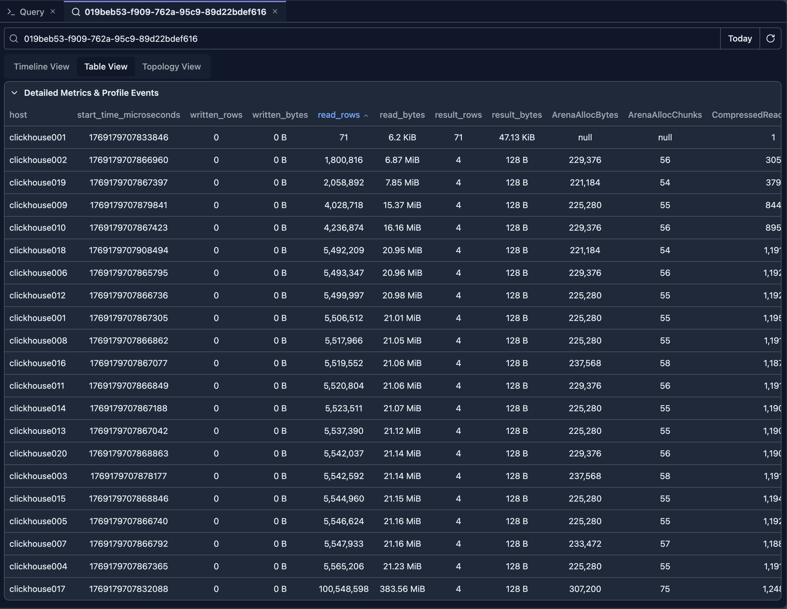
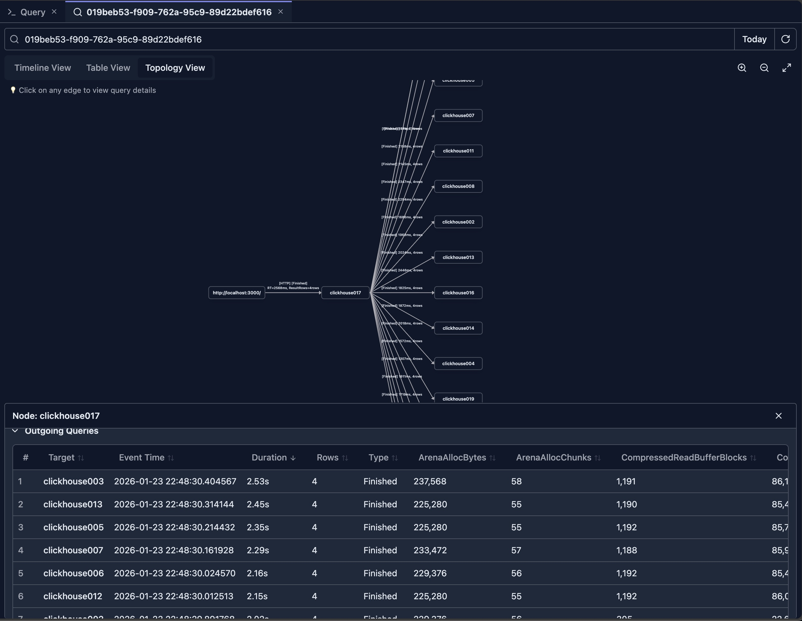

# Query Log Inspector

The Query Log Inspector is one of the most powerful tools for analyzing query performance, understanding query execution patterns, and debugging issues in your ClickHouse cluster. 

It provides multiple visualization modes including timeline views, topology graphs, and detailed table views to help you gain deep insights into your query workload.

## Overview

The Query Log Inspector allows you to:

- **Search Queries**: Find specific queries by Query ID
- **Timeline Visualization**: View query execution over time
- **Topology Graphs**: Visualize query relationships and dependencies
- **Performance Analysis**: Analyze query performance metrics
- **Execution Metrics**: Understand resource usage and execution details
- **Time Range Filtering**: Filter queries by time periods

## Prerequisites

To use the Query Log Inspector, you need:

- **System Table Access**: Read access to `system.query_log` table
- **Query Log Enabled**: `log_queries` setting should be enabled on your ClickHouse server
- **Appropriate Permissions**: Your user must have privileges to query system tables

> **Note:** Contact your administrator if you don't have access to system tables.

The inspector is mainly designed for ClickHouse cluster mode. For a single-replica ClickHouse instance, you can still use it as a tool for better visualization of query metrics from the query log, but you won't gain much benefit from the Timeline or Topology views.

## Accessing Query Log Inspector from Query Tab

After your query completes execution in the query tab, it shows the Query ID as a clickable link under the response.

Simply click the Query ID link to open the inspector for that query.

## Timeline View

When the inspector opens, it loads query logs for the given Query ID from all nodes in the cluster and displays the timeline view by default.

The above picture shows the result of a query executed on a 20-node ClickHouse cluster.

### Understanding the Timeline

The timeline view displays query execution as a horizontal timeline, showing:

- **Query Duration**: Length of bars represents execution time
- **Time Axis**: Horizontal axis shows chronological order
- **Query Relationships**: Parent-child query relationships
- **Concurrent Queries**: Queries running at the same time and are ordered based on query log event time from earliest to latest

### Timeline Features

#### Zoom and Navigation

- **Zoom In**: Click zoom in button or use mouse wheel
- **Zoom Out**: Click zoom out button
- **Pan**: Drag to move the timeline view
- **Reset View**: Return to default zoom level

#### Query Details

- **Hover**: Hover over query bars to see quick details
    
    For example, in the view, there's a query executed on the clickhouse001 node that took only 1ms. You can move the mouse over it to quickly check what query was executed.

    

- **Click**: Click on queries to see full details in the detail pane
    
    The detail pane is displayed on the right side of the timeline view. It shows the full query log of the selected item, including the flattened ProfileEvents which contain all metrics for that query.

    

### Reading the Timeline

#### Query Bars

- **Length**: Represents execution duration
- **Color**: Indicates different nodes
- **Position**: Shows when the query started

#### Parent-Child Relationships

- **Nested Bars**: Child queries appear nested under parent queries
- **Indentation**: Visual hierarchy shows query relationships
- **Distributed Queries**: Shows queries across cluster nodes

Generally, for a distributed query, the root node in the tree represents the initial query sent from the client side. Sub-nodes in the tree are sub-queries sent from the initial nodes to other nodes in the cluster.

#### Concurrent Execution

- **Overlapping Bars**: Queries running at the same time
- **Resource Usage**: Identify periods of high query load
- **Bottlenecks**: Spot times when many queries are queued

## Table View

The timeline view provides a comprehensive overview of how the query is executed in a cluster, showing which nodes are involved in the execution and which nodes take the longest time.

However, it doesn't offer a simple way to compare query metrics across different nodes. The table view solves this problem by presenting metrics in a sortable, tabular format.

### Detailed Query List

The table view provides a comprehensive list of queries with:

- **Query ID**: Unique identifier for each query
- **Timestamp**: When the query was executed
- **Duration**: Execution time in milliseconds
- **Status**: Success, error, or cancelled
- **User**: User who executed the query
- **Query Text**: The SQL query text
- **Metrics**: Performance metrics (rows read, bytes read, etc.)

The **Detailed Metrics & Profile Events** table is the most insightful view for comparing metrics across nodes. You can click the table headers to sort metrics in descending or ascending order.

For example, by clicking the 'read_rows' column, you can see that the clickhouse002 node reads the least rows (note: the first row executes a DESC sub-query which has a different query pattern and should be excluded from analysis).

In a multi-replica ClickHouse cluster, this may suggest that the data is not evenly distributed. Based on this observation, you can investigate further to confirm.

## Topology View

### Understanding Topology

The topology view shows query execution as a graph, displaying:

- **Query Nodes**: Each query as a node in the graph
- **Relationships**: Edges connecting related queries
- **Execution Flow**: Direction of query execution
- **Cluster Topology**: Distributed query execution across nodes

### Topology Features

#### Graph Navigation

- **Zoom**: Zoom in/out on the graph
- **Pan**: Drag to move around the graph
- **Node Selection**: Click nodes to see details
- **Layout**: Automatic layout with manual adjustment options

#### Node Information

- **Query Details**: Click nodes to see full query information
- **Node Colors**: Color coding indicates different nodes in the cluster
- **Node Size**: May represent query duration or importance
- **Labels**: Query IDs or other identifiers

#### Relationship Visualization

- **Edges**: Lines connecting related queries
- **Edge Direction**: Arrows show execution flow
- **Edge Labels**: May show relationship type
- **Highlighting**: Highlight related queries on selection

### Use Cases for Topology View

- **Understanding Query Dependencies**: See how queries relate to each other
- **Distributed Query Analysis**: Visualize queries across cluster nodes
- **Query Chain Analysis**: Follow query execution chains
- **Bottleneck Identification**: Find queries that block others

## Performance Analysis

### Key Metrics

The Query Log Inspector tracks important performance metrics:

#### Execution Metrics

- **Duration**: Total execution time
- **Read Rows**: Number of rows read from tables
- **Read Bytes**: Amount of data read
- **Written Rows**: Rows written (for INSERT queries)
- **Written Bytes**: Data written
- **Result Rows**: Number of rows returned by (sub)queries
- **Result Bytes**: Amount of data returned by (sub)queries
- **Memory Usage**: Peak memory consumption
- **CPU Time**: CPU time used

#### Resource Usage

- **Peak Memory**: Maximum memory used during execution
- **Threads**: Number of threads used
- **Read Operations**: I/O operations performed
- **Network Traffic**: Data transferred over network (for distributed queries)

### Performance Insights

#### Identifying Slow Queries

- **Duration Sorting**: Sort by duration to find slowest queries
- **Threshold Alerts**: Identify queries exceeding time thresholds
- **Pattern Analysis**: Find queries that consistently run slowly

#### Resource Analysis

- **Memory Intensive**: Find queries using excessive memory
- **I/O Intensive**: Identify queries with high read/write operations
- **CPU Intensive**: Spot CPU-heavy queries

#### Optimization Opportunities

- **Frequent Queries**: Identify queries run frequently
- **Expensive Queries**: Find resource-intensive queries
- **Candidates for Optimization**: Queries that would benefit from optimization

## Best Practices

### Regular Monitoring

1. **Daily Review**: Check query log regularly for issues
2. **Performance Trends**: Monitor performance over time
3. **Anomaly Detection**: Look for unusual patterns
4. **Capacity Planning**: Use metrics for capacity planning

### Query Optimization

1. **Identify Slow Queries**: Use duration sorting
2. **Analyze Patterns**: Look for frequently slow queries
3. **Compare Metrics**: Compare before/after optimization
4. **Track Improvements**: Monitor optimization results

### Troubleshooting

1. **Error Analysis**: Review failed queries regularly
2. **Performance Issues**: Investigate slow queries
3. **Resource Problems**: Identify resource-intensive queries
4. **User Activity**: Monitor user query patterns

## Limitations

- **Query Log Retention**: Depends on ClickHouse server configuration
- **Performance Impact**: Querying large query logs may be slow

## Next Steps

- **[Query Explain](./query-explain.md)** — Understand query execution plans
- **[Query Optimization](../02-ai-features/query-optimization.md)** — Optimize your queries with AI

