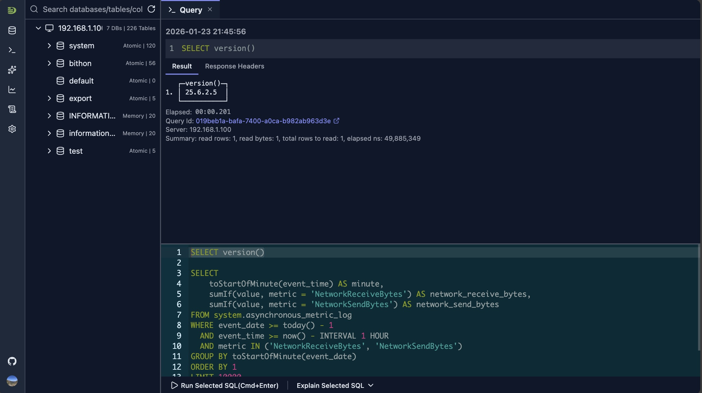
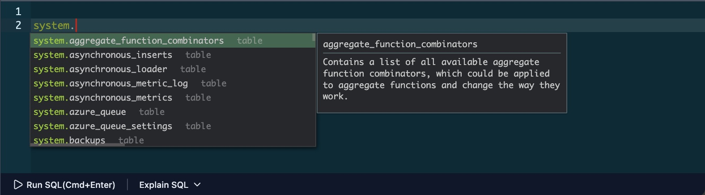
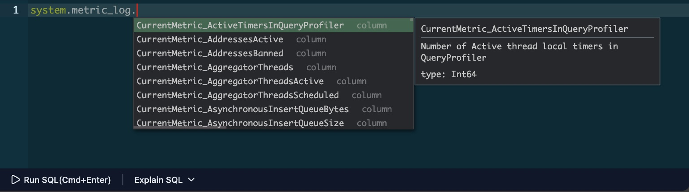
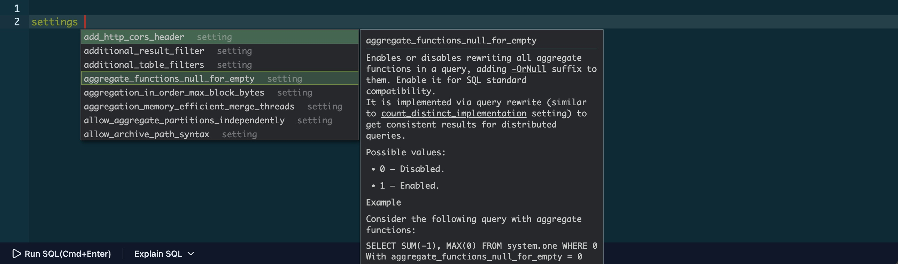
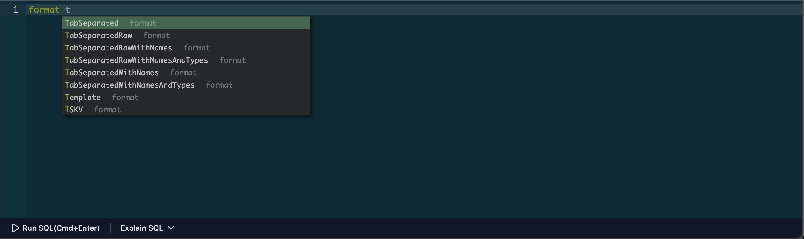
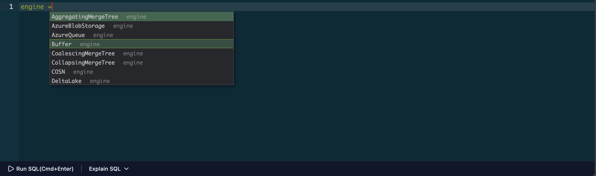
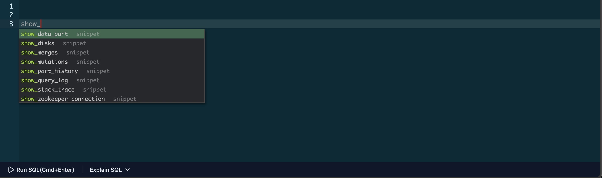

# SQL Editor

DataStoria's SQL Editor provides a powerful, feature-rich environment for writing and editing ClickHouse queries. Built on the Ace Editor framework, it offers syntax highlighting, intelligent auto-completion, and convenient keyboard shortcuts to enhance your productivity.

## Overview

The SQL Editor is the primary interface for writing and executing queries in DataStoria. It provides:

- **Syntax Highlighting**: Color-coded SQL syntax for better readability
- **Auto-completion**: Intelligent suggestions for tables, columns, SQL keywords, settings, formats, and engines
- **Keyboard Shortcuts**: Quick access to common operations
- **Query Snippets**: Reusable code templates for common operations
- **Local Storage**: Automatic saving of your work

## Layout

The SQL editor is displayed on the right side of the schema tree. It features a terminal-like interface where you type SQL queries in the lower part of the query tab. Query requests and responses are displayed above the editor region, and the response area automatically scrolls as new results arrive.

## Syntax Highlighting

The editor automatically highlights SQL syntax with color coding:

- **Keywords**: SQL reserved words (SELECT, FROM, WHERE, etc.)
- **Strings**: Text literals in single or double quotes
- **Numbers**: Numeric values
- **Comments**: Single-line (`--`) and multi-line (`/* */`) comments
- **Functions**: Built-in ClickHouse functions

The editor adapts to your theme preference (light or dark mode) for optimal visibility.

## Auto-completion

The editor provides intelligent auto-completion suggestions as you type:

### SQL Keyword Completion

The editor recognizes ClickHouse SQL syntax and suggests:
- SQL keywords (SELECT, INSERT, CREATE, etc.)
- ClickHouse-specific functions
- Data types
- Query modifiers

### Table and Column Suggestions

When you type a table name or reference a database, the editor suggests:
- Available tables in the current database
  

- Columns for the current table
  

### ClickHouse Settings Suggestions

When you type `SETTINGS`, `SET`, or `settings` (case-insensitive), the editor automatically suggests all available ClickHouse settings with their current values and descriptions.

### ClickHouse Input/Output Formats Suggestions

When you type `FORMAT` or `format` (case-insensitive), the editor suggests all supported input and output formats available in your ClickHouse instance.

### ClickHouse Table Engine

When you type `=` after the `ENGINE` keyword, the editor suggests all supported table engines available in your ClickHouse instance.

### ON CLUSTER

If your connection is configured for cluster mode, the editor suggests `ON CLUSTER {your_cluster_name}` and your cluster name as you type, making it easy to write cluster-wide operations.

### Triggering Auto-completion

- **Automatic**: Suggestions appear as you type
- **Manual**: Press `Alt + Space` (Windows/Linux) or `Option + Space` (Mac) to trigger suggestions
- **Navigation**: Use arrow keys to navigate suggestions, use Enter/Tab to select

## Keyboard Shortcuts

### Query Execution

- **Execute Query**: `Ctrl + Enter` (Windows/Linux) or `Command + Enter` (Mac)
  - Executes the current query or selected text
  - If text is selected, only the selection is executed

> **See also**: [Error Diagnostics](./error-diagnostics.md) for help with syntax errors, and [Query Explain](./query-explain.md) to understand query performance.

## Query Snippets

The editor includes built-in query snippets for common operations:

### Using Snippets

1. Type `show_` to trigger snippet suggestions
2. Select a snippet from the suggestions
3. Press `Tab` to expand the snippet
4. Fill in the placeholders
5. Navigate between placeholders with `Tab`

## Local Storage

The editor automatically saves your work:

- **Auto-save**: Your query is saved automatically as you type
- **Persistent**: Saved queries persist across browser sessions

## Tips and Tricks

### Selecting and Executing Partial Queries

- **Select Text**: Highlight the portion of your query you want to test
- **Execute Selection**: Press `Ctrl + Enter` (Windows/Linux) or `Command + Enter` (Mac) to execute only the selection
- **Use Case**: Perfect for testing individual parts of complex queries without running the entire query

### Multi-line Editing

- **Create Multiple Cursors**: Use `Alt + Click` (Windows/Linux) or `Option + Click` (Mac) to place multiple cursors
- **Simultaneous Editing**: Edit multiple lines at once
- **Bulk Changes**: Great for renaming variables, adding prefixes, or making consistent changes across multiple lines

### Quick Navigation

- **Go to Line**: Press `Ctrl + G` (Windows/Linux) or `Command + G` (Mac) to jump to a specific line number
- **Find Text**: Press `Ctrl + F` (Windows/Linux) or `Command + F` (Mac) to search within your query
- **Find and Replace**: Press `Ctrl + H` (Windows/Linux) or `Command + H` (Mac) to find and replace text

### Efficient Auto-completion

- **Use Tab Completion**: After typing a few characters, use `Tab` to accept the first suggestion
- **Browse Suggestions**: Use arrow keys to navigate through suggestions when multiple options are available
- **Context-Aware**: Suggestions adapt based on your current typing context (table names, column names, etc.)

### Query Organization

- **Multiple Tabs**: Open multiple query tabs to work on different queries simultaneously
- **Auto-save**: Your queries are automatically saved, so you won't lose your work
- **Clear Workspace**: Delete completed queries from the results panel to keep your workspace clean

## Limitations

- Very large queries (10,000+ lines) may experience performance degradation
- Auto-completion suggestions depend on schema metadata availability
- Some advanced editor features may not be available in all browsers

## Next Steps

- **[Query Execution](./query-execution.md)** — Learn how to execute queries and view results
- **[Error Diagnostics](./error-diagnostics.md)** — Understand how to diagnose and fix query errors
- **[Natural Language SQL](../02-ai-features/natural-language-sql.md)** — Use AI to generate queries from natural language

