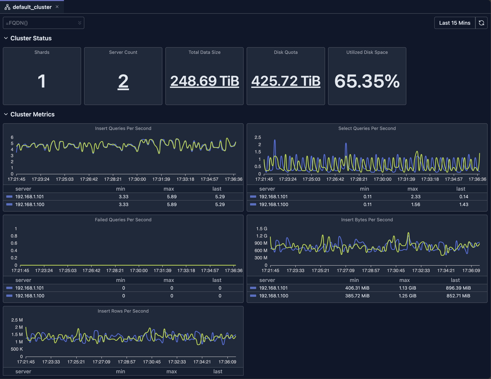

# Cluster Dashboard

The Cluster Dashboard provides a high-level overview of your entire ClickHouse cluster, showing aggregate metrics across all nodes.

## Overview

The Cluster Dashboard is a pre-configured monitoring view that requires no setup. It automatically:

- **Aggregates Metrics**: Collects data from ClickHouse system tables across all nodes
- **Visualizes Performance**: Displays metrics as charts, gauges, and tables
- **Supports Filtering**: Allows you to filter by time range, hostname, and other dimensions
- **Provides Drill-downs**: Click on metrics to see detailed breakdowns
- **Updates in Real-time**: Refreshes automatically or manually to see latest data

## Prerequisite

Your database connection must be configured as cluster.

## Opening the Cluster Dashboard

1. **Open Cluster Tab**: Click on the cluster name in the sidebar or navigate to the cluster view
2. **View Dashboard**: The cluster dashboard displays automatically

## Cluster Dashboard Overview

## Dashboard Features

### Time Range Selection

The dashboard supports flexible time range selection:

- **Predefined Ranges**: Last 15 minutes, Last hour, Today, This week, etc.
- **Custom Range**: Select specific start and end times
- **Auto-refresh**: Automatically refresh data at intervals (where supported)

### Filtering

- **Hostname Filter**: Filter by specific nodes

### Chart Types

The dashboard uses various visualization types:

- **Stat Cards**: Single-value metrics with drill-downs
- **Line Charts**: Time-series data with multiple series
- **Bar Charts**: Distribution and comparison data
- **Gauges**: Percentage and threshold indicators
- **Tables**: Detailed data with sorting and pagination

### Drill-downs

Many metrics support drill-down functionality to view the breakdown of original metric.

### Refresh and Auto-refresh

- **Manual Refresh**: Click the refresh button to update data
- **Auto-refresh**: Enable automatic updates (where supported)

## Limitations

- **System Table Access**: Requires read access to ClickHouse system tables
- **Data Retention**: Metrics depend on ClickHouse's system tables retention settings
- **Availability**: Requires your ClickHouse nodes to be available
- **Version Compatibility**: Some metrics may not be available in older ClickHouse versions
- **Performance Impact**: Querying large time ranges may be slow and consumes resources of your ClickHouse cluster

> **Deep dive**: Explore [System Log Introspection](./system-log-introspection.md) for detailed analysis of system tables.

## Next Steps

- **[Node Dashboard](./node-dashboard.md)** — View detailed metrics for individual nodes
- **[Query Log Inspector](../03-query-experience/query-log-inspector.md)** — Analyze specific query performance
- **[Schema Explorer](./schema-explorer.md)** — Explore your database structure
- **[System Log Introspection](./system-log-introspection.md)** — Deep dive into query and part logs

