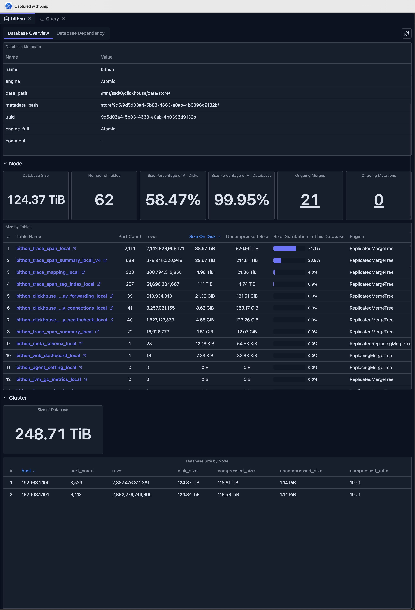

# Database View

The Database View provides a comprehensive overview of a ClickHouse database, including statistics, table information, and dependency visualization. It serves as a central hub for understanding database structure, performance, and health, enabling efficient database monitoring and management.

## Overview

The Database View combines multiple perspectives into a unified interface:

- **Database Overview Tab**: Statistics, metrics, and table information
- **Database Dependency Tab**: Visual graph of table dependencies within the database

## Accessing the Database View

To access the Database View in ClickHouse Console:

1. **Navigate to Database**: Click on a database name in the Schema Explorer sidebar
2. **Database Tab Opens**: The Database View opens automatically in a new tab
3. **View Overview**: The Database Overview tab is displayed by default, showing comprehensive database statistics and metrics

## Database Overview Tab

The Database Overview tab provides comprehensive statistics and information about your ClickHouse database, enabling you to monitor database health, track performance metrics, and understand database structure at a glance.

### Database Metadata

View essential database information:

- **Database Name**: The name of the database
- **Engine Type**: Database engine (if applicable)
- **Metadata**: All metadata fields from `system.databases`

### Key Statistics

The overview displays important metrics:

#### Database Size

- **Total Size**: Combined size of all tables in the database
- **Size on Disk**: Actual disk space used
- **Uncompressed Size**: Size before compression
- **Size Percentage**: Percentage of total disk space used

#### Table Information

- **Number of Tables**: Total count of tables in the database
- **Table List**: Detailed table information with:
  - Table name
  - Engine type
  - Row count
  - Size on disk
  - Uncompressed size
  - Size distribution percentage
  - Part count
  - Metadata modification time
  - Data modification time

#### Size Distribution

- **Size Percentage of All Disks**: How much of total disk space this database uses
- **Size Percentage of All Databases**: How this database compares to others
- **Table Size Distribution**: Visual breakdown of size by table

### Ongoing Operations

Monitor active database operations:

#### Ongoing Merges

- **Merge Count**: Number of active merge operations
- **Merge Details**: Click to see detailed merge information:
  - Table name
  - Result part name
  - Number of parts being merged
  - Elapsed time
  - Progress percentage
  - Memory usage
  - Bytes read/written
  - Rows read/written

#### Ongoing Mutations

- **Mutation Count**: Number of active mutation operations
- **Mutation Details**: Click to see detailed mutation information:
  - Database and table
  - Mutation ID
  - Command being executed
  - Parts remaining
  - Failure information (if any)

### Table Size Analysis

View detailed table size information:

- **Sortable Table**: Sort by size, row count, or modification time
- **Quick Access**: Click table names to open table details
- **Size Visualization**: See size distribution with percentage bars
- **Engine Information**: View table engine types
- **Modification Times**: Track when metadata and data were last modified

### Cluster Mode Features

When connected to a cluster, additional metrics are available:

#### Cluster-wide Statistics

- **Aggregate Database Size**: Total size across all nodes
- **Node Breakdown**: Size distribution by node
- **Compression Ratios**: Compression statistics per node
- **Part Counts**: Part distribution across cluster

#### Node Comparison

Compare database size and statistics across cluster nodes:

- **Hostname**: Each node in the cluster
- **Part Count**: Number of parts per node
- **Row Count**: Total rows per node
- **Disk Size**: Size on disk per node
- **Compressed/Uncompressed Size**: Storage metrics
- **Compression Ratio**: Compression efficiency

## Database Dependency Tab

The Database Dependency tab shows a visual graph of all table dependencies within the database. This is a powerful tool for understanding the relationships between your tables, tracking data lineage, and identifying dependencies for materialized views and other database objects.

### Features

- **Complete Dependency Graph**: All tables and their relationships, including:
    - Distributed tables and their local tables
    - Source and targets of Materialized Views
    - Dictionary
    - MySQL table engine and MySQL server
    - Kafka table and Kafka server
- **Interactive Navigation**: Click nodes to view table details
- **Upstream/Downstream View**: See dependency directions
- **Table Details Panel**: View table DDL statements and metadata

For detailed information about the dependency view, see [Dependency View](./dependency-view.md).

## Limitations

When using the Database View, be aware of the following limitations:

- **System Table Access**: Requires read access to ClickHouse system tables (`system.databases`, `system.tables`, `system.parts`, etc.)
- **Data Retention**: Metrics depend on ClickHouse's system tables retention policies and may not show historical data beyond the retention period
- **Performance Impact**: Querying large databases with many tables may be slow, especially when loading comprehensive statistics
- **Real-time Accuracy**: Some metrics may have slight delays as they are based on system table snapshots rather than real-time data
- **Version Compatibility**: Some features may not be available in older ClickHouse versions, as they depend on specific system table columns and functionality

## Best Practices

### Regular Monitoring

- **Schedule Reviews**: Regularly review database statistics
- **Track Trends**: Monitor size and operation trends over time
- **Set Alerts**: Use metrics to identify issues early

### Performance Optimization

- **Identify Large Tables**: Focus optimization on large tables
- **Monitor Operations**: Track merge and mutation performance
- **Balance Resources**: Use cluster metrics to balance load

### Maintenance Planning

- **Plan Maintenance**: Use statistics to plan maintenance windows
- **Track Changes**: Monitor modification times for change tracking
- **Optimize Storage**: Use size information for storage optimization

## Integration with Other Features

- **Schema Explorer**: Navigate to specific tables from the overview
- **Table View**: Open detailed table views from the table list
- **Dependency View**: Access dependency visualization from the dependency tab
- **Cluster Dashboard**: Compare with cluster-wide metrics
- **Query Editor**: Use database information when writing queries

## Next Steps

- **[Dependency View](./dependency-view.md)** — Explore table dependencies and relationships
- **[Table View](./table-view.md)** — View detailed table information
- **[Cluster Dashboard](../05-monitoring-dashboards/cluster-dashboard.md)** — Monitor cluster-wide metrics
- **[Node Dashboard](../05-monitoring-dashboards/node-dashboard.md)** — View individual node performance
- **[Schema Explorer](./schema-explorer.md)** — Navigate database structure
