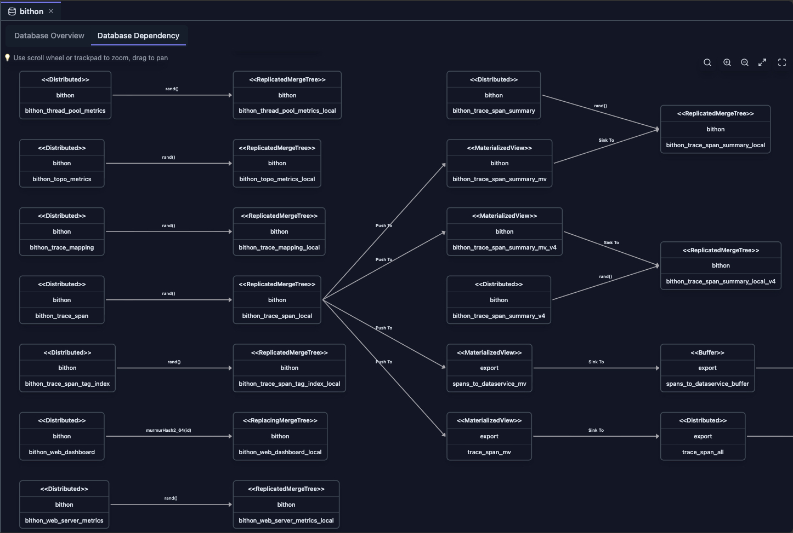

# Dependency View

The Dependency View provides an interactive graph visualization of table dependencies in your ClickHouse database. It helps you understand how tables relate to each other, track data lineage, and identify dependencies for materialized views, views, and other database objects.

## Overview

The Dependency View automatically analyzes your ClickHouse schema to build a comprehensive dependency graph showing:

- **Table Dependencies**: Which tables depend on other tables
- **Materialized View Dependencies**: Relationships between materialized views and their source tables
- **View Dependencies**: Dependencies for regular views
- **Upstream Dependencies**: Tables that a specific table depends on
- **Downstream Dependencies**: Tables that depend on a specific table
- **Interactive Navigation**: Click on nodes to view detailed table information

## Example

The following example demonstrates a database dependency graph visualization.

The dependency graph visualizes the following relationships:

- **Distributed Table Connections**: Shows the relationship between each distributed table and its corresponding local table
- **Materialized View Dependencies**: Displays source and target tables for materialized views, showing data flow direction
- **Table Representation**: Each table is represented by a rectangle using a UML class diagram style for easy recognition
- **Sharding Key Information**: Edge labels between distributed tables and local tables display the sharding key, allowing you to quickly identify whether the distributed table uses random sharding or specific column-based sharding
- **Materialized View Data Flow**: 
  - **Incoming Edge** (labeled as *Push To*): Represents the source table where data originates
  - **Outgoing Edge** (labeled as *Sink to*): Represents the target table where processed data is written
- **Interactive Details**: Clicking on any table node displays the complete DDL (Data Definition Language) statement in the right panel, providing full table structure information

## Accessing the Dependency View

The Dependency View is accessible from two locations in ClickHouse Console, each providing a different perspective on table dependencies:

### From Database Tab

1. **Open Database Tab**: Click on a database name in the Schema Explorer
2. **Select Dependency Tab**: Click on the "Database Dependency" tab
3. **View Graph**: The dependency graph for all tables in the database is displayed, showing the complete dependency network within the database

### From Table Tab

1. **Open Table Tab**: Click on a table name in the Schema Explorer
2. **Select Dependencies Tab**: Click on the "Dependencies" tab
3. **View Focused Graph**: The dependency graph is filtered to show only dependencies related to the selected table, providing a focused view of upstream and downstream relationships

## Features

### Interactive Graph Visualization

The dependency graph displays:

- **Nodes**: Represent tables, materialized views, and other database table objects
- **Edges**: Represent dependency relationships (arrows show direction)
- **Node Categories**: Different colors or styles for different table types
- **Zoom and Pan**: Navigate large dependency graphs easily
- **Node Highlighting**: Hover or click nodes to see details

### Upstream and Downstream Analysis

When viewing dependencies for a specific table:

- **Upstream Dependencies**: Shows all tables that the selected table depends on (what feeds into it)
- **Downstream Dependencies**: Shows all tables that depend on the selected table (what it feeds into)
- **Complete Context**: Includes both upstream and downstream in a single view

### Table Details Panel

Click on any node in the graph to open a detailed panel showing:

- **Table Metadata**: Database, table name, engine type
- **Table Query**: The CREATE TABLE statement
- **Dependencies**: List of tables this table depends on
- **Metadata Information**: Last modification time and other metadata

## Use Cases

### Understanding Data Lineage

- **Track Data Flow**: See how data flows from source tables to materialized views
- **Impact Analysis**: Understand what will be affected if you modify a table
- **Documentation**: Visualize your database architecture

### Schema Refactoring

- **Safe Changes**: Identify all dependencies before modifying or dropping tables
- **Migration Planning**: Understand relationships when restructuring schemas
- **Risk Assessment**: See downstream impact of schema changes

### Performance Optimization

- **Bottleneck Identification**: Find tables with many downstream dependencies
- **Optimization Targets**: Identify frequently used tables that might benefit from optimization
- **Materialized View Analysis**: Understand materialized view dependencies for optimization

### Troubleshooting

- **Error Investigation**: Trace dependencies when queries fail
- **Data Quality**: Understand data lineage for quality issues
- **Debugging**: Visualize relationships when debugging complex queries

## Graph Navigation

### Zoom Controls

- **Zoom In**: Use mouse wheel or zoom controls
- **Zoom Out**: Scroll out or use zoom controls
- **Fit to View**: Automatically adjust to show all nodes

### Node Interaction

- **Click Node**: Opens detailed table information panel
- **Hover**: Highlights connected edges
- **Select**: Focuses on specific table dependencies

### Panel Management

- **Resize Panel**: Drag the panel border to adjust size
- **Close Panel**: Click the close button to hide the panel
- **Panel Content**: View table metadata, query, and dependencies

## Limitations

When using the Dependency View, consider the following limitations:

- **System Tables**: Some system tables may not show dependencies correctly, as they have special structures and relationships
- **Kafka Tables**: Kafka engine tables may have limited dependency information, as their dependencies are based on external Kafka topics rather than database objects
- **External Tables**: URL and other external table engines may not show dependencies, as they reference external resources rather than database objects
- **Complex Queries**: Very complex CREATE TABLE queries with nested expressions or advanced features may not parse all dependencies correctly
- **Performance**: Large databases with many tables may take time to build the dependency graph, especially when analyzing complex relationships
- **Real-time Updates**: Dependency graph reflects schema at the time of loading and does not automatically update when schema changes occur; refresh the view after making schema modifications

## Best Practices

### Regular Updates

- **Refresh After Changes**: Refresh the dependency view after schema changes
- **Monitor Changes**: Use dependency view to track schema evolution
- **Documentation**: Use dependency graphs for architecture documentation

### Performance Considerations

- **Large Databases**: For databases with many tables, consider viewing dependencies for specific tables
- **Caching**: Dependency data is cached for performance
- **Selective Viewing**: Use table-specific dependency view for focused analysis

## Integration with Other Features

- **Schema Explorer**: Navigate to tables from the dependency graph
- **Table Tab**: View detailed table information from dependency nodes
- **Database Tab**: Access database-level dependency overview
- **Query Editor**: Use dependency information when writing queries

## Next Steps

- **[Database View](./database-view.md)** — Explore database overview and statistics
- **[Table View](./table-view.md)** — View detailed table information and metadata
- **[Schema Explorer](./schema-explorer.md)** — Navigate your database structure
- **[Cluster Dashboard](../05-monitoring-dashboards/cluster-dashboard.md)** — Monitor cluster-wide metrics
