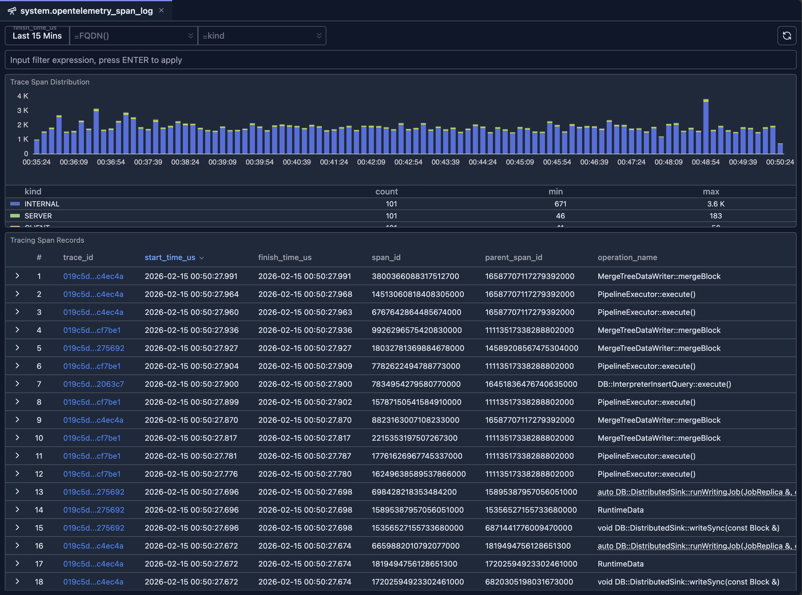

# system.opentelemetry_span_log Introspection

The OpenTelemetry Span Log Introspection tool lets you analyze spans stored in ClickHouse’s `system.opentelemetry_span_log` table. Use it to inspect trace span distribution over time, filter by host or span kind, and explore individual span records with clickable trace IDs for deeper analysis.

## Overview

When ClickHouse is configured to produce [OpenTelemetry](https://opentelemetry.io/) trace data, span events are written to `system.opentelemetry_span_log`. This introspection UI provides:

- **Time-scoped analysis** — Choose a time range (default: last 15 minutes) for all charts and the table.
- **Trace Span Distribution chart** — Stacked bar chart of span counts over time, grouped by span `kind` (e.g. server, client, internal).
- **Tracing Span Records table** — Paginated, sortable list of span rows with trace ID links, start/finish times, span IDs, and optional row details.

You can combine time range, hostname (FQDN), and span kind filters to focus on specific nodes or span types.

## Prerequisites

- ClickHouse is configured to write tracing data into `system.opentelemetry_span_log` table.
- Read access to the `system.opentelemetry_span_log` table.

## UI

If the `trace_id` column is clicked, a new tab will be open to allow you to inspect the details of the given trace span logs as demonstrated in the following video.

<Video src="./img/system-opentelemetry-span-log-inspector.webm" alt="System Opentelemetry span log inspector" />

## When to use this tool

### Distributed tracing and debugging

1. **Find traces by time**: Set a time range and scan the table for slow or failed operations.
2. **Filter by host**: Use FQDN to see spans only from the node you care about.
3. **Filter by kind**: Use span kind to focus on server spans, client calls, or messaging spans.
4. **Follow a trace**: Click a trace ID to open the full trace in the inspector.

### Observability and capacity

1. **Volume over time**: Use the distribution chart to see span throughput and which kinds dominate.
2. **Compare nodes**: Change FQDN filter to compare span volume or kinds across replicas.
3. **Narrow by expression**: Use the input filter for custom conditions (e.g. by service or attribute).

### Integration with other tools

- **Span Log Inspector**: Use trace ID links from this table to jump into timeline and topology views for a single trace.
- **Other system tables**: Cross-reference with [system.query_log](./system-query-log.md) or [system.query_views_log](./system-query-views-log.md) when correlating queries with traces.

## Related documentation

- **[System Log Introspection](./system-log-introspection.md)** — Overview of all system log introspection tools
- **[Query Log Inspector](../03-query-experience/query-log-inspector.md)** — Timeline and topology for a single query or trace
- **[Schema Explorer](./schema-explorer.md)** — Explore databases and tables, including `system.opentelemetry_span_log`
- **[Node Dashboard](../05-monitoring-dashboards/node-dashboard.md)** — Node-level metrics and health
