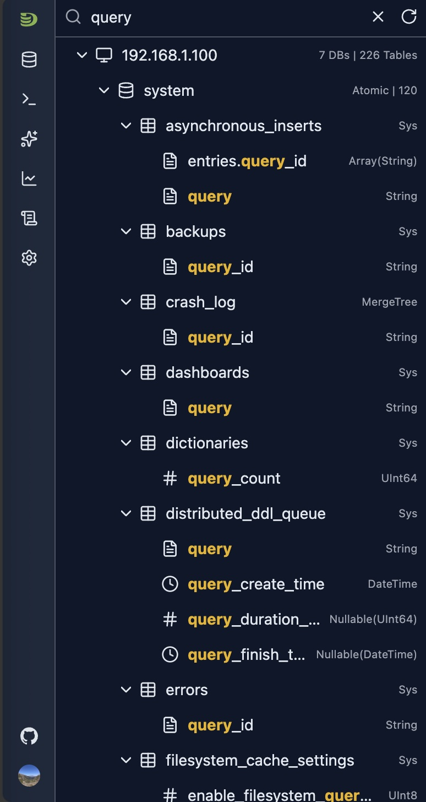
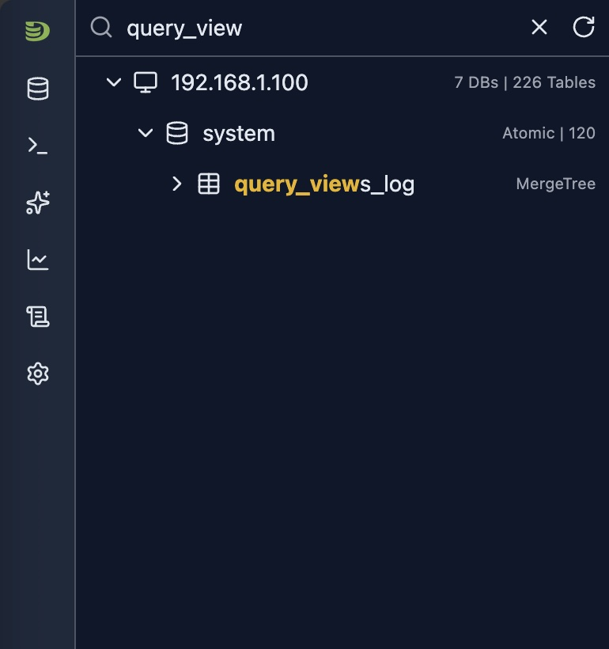
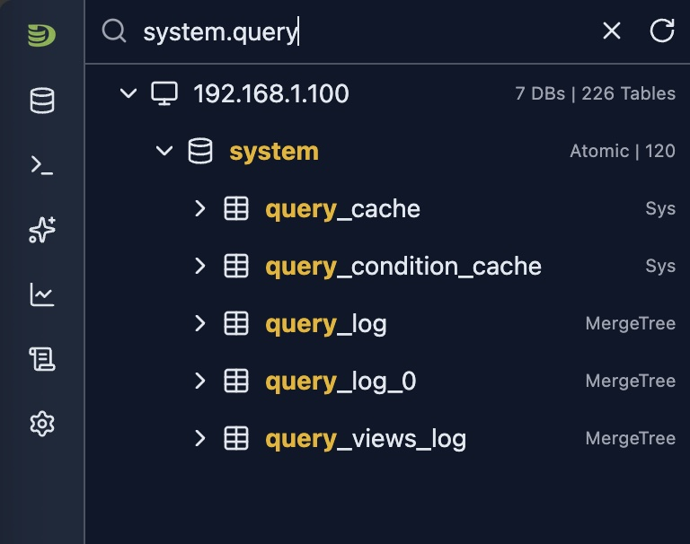

# Schema Explorer

The Schema Explorer provides an intuitive, tree-based interface for navigating your ClickHouse databases, tables, columns, and metadata. It serves as the central navigation hub in DataStoria, allowing you to quickly access and explore your database structure.

## Overview

The Schema Explorer displays your ClickHouse schema as an expandable tree structure, showing:

- **Databases**: All databases in your ClickHouse instance
- **Tables**: All tables within each database
- **Columns**: Table columns with data types and metadata
- **Comments**: Database, table, and column comments (if available)
- **Table Engines**: Engine type for each table
- **Cluster Nodes**: In cluster mode, shows nodes and their schemas

## Accessing the Schema Explorer

The Schema Explorer is located in the **left sidebar** of the DataStoria interface. It automatically loads when you connect to a ClickHouse instance.

### Initial Load

- **Automatic Loading**: Schema loads automatically upon connection
- **Progress Indicator**: Shows loading progress during initial schema fetch
- **Error Handling**: Displays error messages if schema loading fails

## Tree Structure

### Hierarchy

The schema tree follows this hierarchy:

```
Host/Cluster
  └── Database
      └── Table
          └── Column -- Data Type
```

### Node Types

#### Host/Cluster Node

- **Single Node**: Shows the hostname where the schema tree information is returned
- **Cluster Mode**: Shows the hostname where the schema tree information is returned with a selection list showing all nodes in the cluster
- **Actions**: Refresh schema, switch nodes (in cluster mode)


## Navigation Features

### Search Functionality

The Schema Explorer includes a powerful search feature, search from databases/tables/columns.

#### Search Behavior

- **Real-time Filtering**: Search is performed at local, results update as you type
- **Fuzzy Matching**: Finds partial matches in names with exact match(See dot mode below)

  - Under Fuzzy matching, you can search a database/table/column. The matched items will be displayed hierachy under their databases/tables

- **Case Insensitive**: Search is not case-sensitive
- **Scope**: Searches across databases, tables, and columns
- **Dot mode**

    By default the search is performed across all database, tables, columns.But if a dot character is input, the text before the first dot character will be treated as a exact match against database. And the text between first dot and second dot character will be treated as an extract table name.

    Once the dot is typed, and there is a database match, the matched database will automatically expand its tables. So does the table exact match.

#### Examples

- Search database/table/columns that contains 'query'



- Search table



- Search tables under a given database(DOT Mode)



### Context Menus

Right-click on any node to access context menu options.

## Actions and Shortcuts

### Open Node Status Tab

- **Method**: Click host name
- **Shows**: The node status dashboard in a tab


### Open Database Tab

- **Method**: Click database name
- **Shows**: Database overview with tables, statistics and table dependencies

### Open Table Tab

- **Method**: Click table name
- **Shows**: Table details including:
  - Table metadata
  - Column information
  - Data sample
  - Partitions
  - Query history
  - Dependencies


## Limitations

- **Real-time Updates**: Schema changes require manual refresh
- **Performance**: Initial load time depends on schema size
- **Permissions**: Schema visibility depends on user permissions

### Integration with Other Features

- **Query Editor**: Drag table names from schema tree to query editor (if supported)
- **Table Tabs**: Open multiple tables in separate tabs

## Next Steps

- **[SQL Editor](../03-query-experience/sql-editor.md)** — Query the tables you've discovered
- **[Natural Language Queries](../02-ai-features/natural-language-sql.md)** — Ask questions about your data
- **[Cluster Dashboard](../05-monitoring-dashboards/cluster-dashboard.md)** — Monitor cluster-wide metrics
- **[Node Dashboard](../05-monitoring-dashboards/node-dashboard.md)** — Monitor individual node performance

