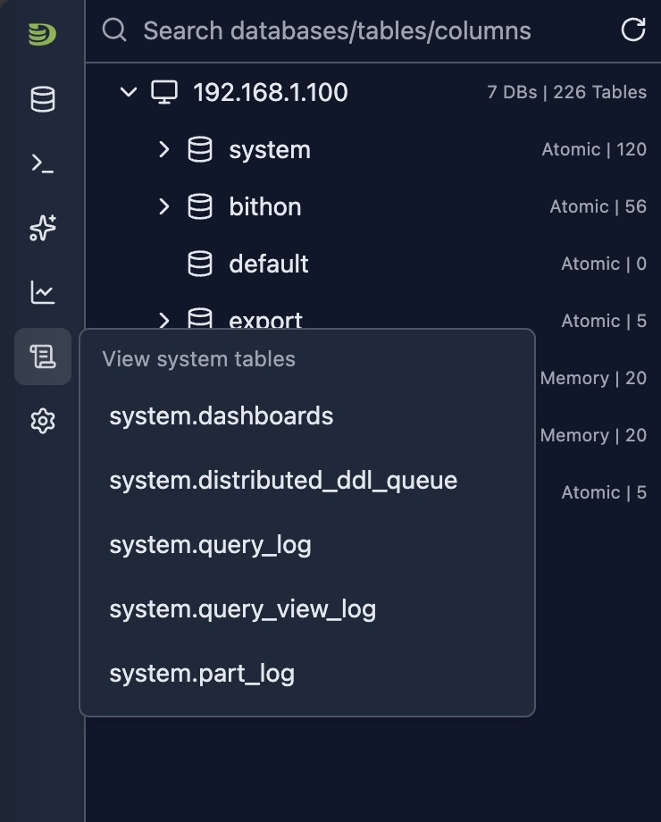

# System Log Introspection

DataStoria provides powerful system log introspection tools that allow you to analyze ClickHouse system tables in detail. These tools help you understand query patterns, identify performance issues, debug errors, and monitor data part operations across your cluster.

## Overview

Currently these system tables are supported:

- **[system.query_log](./system-query-log.md)** — Analyze query execution logs with filters, charts, and AI-powered insights
- **[system.query_views_log](./system-query-views-log.md)** — Monitor query view executions including materialized views and live views
- **[system.part_log](./system-part-log.md)** — Monitor part-level operations including merges, mutations, and downloads
- **[system.ddl_distribution_queue](./system-ddl-distributed-queue.md)** — Monitor distributed DDL operations across cluster nodes
- **system.dashboard** — Dashboard configuration and metadata

You can access these introspection tools from the side bar icon button as shown below:

## Available System Tables

### system.query_log

The Query Log Introspection tool provides deep insights into all queries executed on your ClickHouse cluster. It includes comprehensive filtering, distribution charts, and AI-powered optimization suggestions.

**[Learn more about system.query_log →](./system-query-log.md)**

### system.query_views_log

The Query Views Log Introspection tool provides insights into all query view executions on your ClickHouse cluster. It tracks how materialized views, live views, and other view types are being executed, including their performance metrics, read/write patterns, and error information.

**[Learn more about system.query_views_log →](./system-query-views-log.md)**

### system.part_log

The Part Log Introspection tool tracks all part-level operations in your ClickHouse cluster, including merges, mutations, downloads, and removals. Monitor merge activity, track part creation, and identify mutation patterns.

**[Learn more about system.part_log →](./system-part-log.md)**

### system.ddl_distribution_queue

The DDL Distribution Queue Introspection tool provides insights into distributed DDL operations across your ClickHouse cluster. It tracks how DDL statements (CREATE, ALTER, DROP, etc.) are distributed and executed across cluster nodes, helping you monitor DDL operation status, identify failures, and track execution progress.

**[Learn more about system.ddl_distribution_queue →](./system-ddl-distributed-queue.md)**

## Common Features

All system log introspection tools share common features:

- **Time-based Filtering**: Flexible time range selection for historical analysis
- **Multi-dimensional Filtering**: Filter by hostname, database, table, and more
- **Visual Analytics**: Charts and tables for pattern recognition
- **Server-side Sorting**: Sort by any column for efficient data exploration
- **Pagination**: Navigate through large result sets efficiently
- **AI Integration**: Get optimization suggestions and error explanations

## Best Practices

### Regular Monitoring

1. **Daily Review**: Check query and part logs daily
2. **Set Baselines**: Establish normal operation patterns
3. **Alert on Anomalies**: Identify unusual patterns
4. **Track Trends**: Monitor metrics over time

### Performance Optimization

1. **Identify Slow Operations**: Sort by duration
2. **Use AI Features**: Leverage AI optimization and error explanation
3. **Compare Time Periods**: Use time range selector to compare performance
4. **Filter Strategically**: Use filters to focus on relevant data

### Troubleshooting

1. **Start Broad**: Begin with wide time ranges
2. **Narrow Down**: Use filters to focus on specific issues
3. **Use AI**: Get AI-powered insights for complex problems
4. **Cross-reference**: Use Query ID links to connect query and part logs

### Security and Compliance

1. **User Auditing**: Filter by user to track access patterns
2. **Table Access**: Monitor which tables are accessed
3. **Error Review**: Regularly review exception logs
4. **Export Logs**: Use table features for compliance reporting

## Limitations

- **System Table Access**: Requires read access to system tables
- **Log Retention**: Data availability depends on ClickHouse log retention settings
- **Performance**: Querying large time ranges may be slow
- **Version Compatibility**: Some features may vary by ClickHouse version
- **Cluster Mode**: Some filters are only available in cluster mode

## Next Steps

- **[Cluster Dashboard](../05-monitoring-dashboards/cluster-dashboard.md)** — Monitor cluster-wide metrics
- **[Node Dashboard](../05-monitoring-dashboards/node-dashboard.md)** — Monitor individual node metrics
- **[Query Log Inspector](../03-query-experience/query-log-inspector.md)** — Analyze specific query execution
- **[Schema Explorer](./schema-explorer.md)** — Explore your database structure

