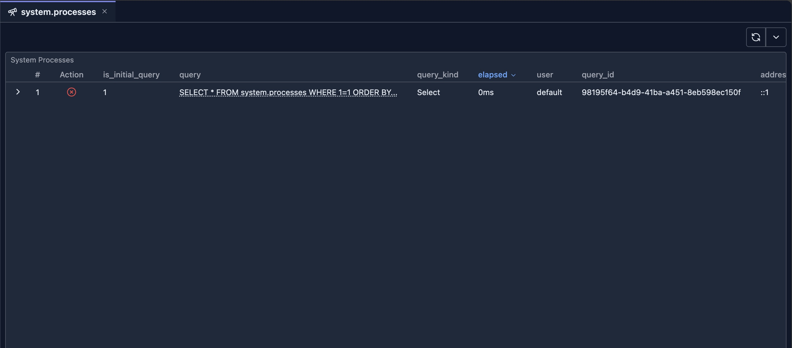

# system.processes Introspection

The Processes Introspection tool provides real-time visibility into all currently running queries on your ClickHouse cluster. It displays a comprehensive table of active processes with detailed information about each query, and allows you to kill problematic queries directly from the UI.

## Prerequisites

> **Note**: Read access to the `system.processes` table and permission to execute `KILL QUERY` commands are required to use this introspection tool. Ensure your user has the necessary system table privileges.

## UI

The Processes Introspection tool displays a single table showing all active queries from `system.processes`. Each row represents a currently running query with detailed information about its execution state.

## Features

### Real-Time Process Monitoring

The tool displays all columns from the `system.processes` table, including:

- **Query Information**: Query ID, query text, and query start time
- **User Information**: User who initiated the query
- **Resource Usage**: Memory usage, read/written rows and bytes
- **Execution Metrics**: Query duration, elapsed time
- **Connection Details**: Client information, interface type

### Kill Query Action

Each row includes an action column with a "Kill" button that allows you to terminate running queries:

1. **Click the Kill Button**: Click the red "Kill" button in the Action column for the query you want to terminate
2. **Confirm Action**: A confirmation dialog will appear asking you to confirm the kill operation
3. **Query Execution**: Once confirmed, the system will execute:
   - `KILL QUERY WHERE query_id = 'xxx'` for single-node mode
   - `KILL QUERY WHERE query_id = 'xxx' ON CLUSTER 'cluster_name'` for cluster mode
4. **Result Notification**: You'll receive a success or error notification after the operation completes

### Table Features

- **Sorting**: Click column headers to sort by any column (default: query_start_time descending)
- **Pagination**: Navigate through pages of results (100 rows per page)
- **Row Details**: Expand rows to see full query details in a transposed view
- **Auto-Refresh**: Use the refresh button to update the process list manually
- **Compact Mode**: View more information in a compact table layout

## When to Use

### Monitoring Long-Running Queries

1. **Identify Slow Queries**: Sort by `query_duration_ms` to find queries that have been running for a long time
2. **Monitor Resource Usage**: Check `memory_usage` to identify memory-intensive queries
3. **Track Query Progress**: Monitor `read_rows` and `read_bytes` to see query execution progress

### Managing Problematic Queries

1. **Kill Hung Queries**: Terminate queries that appear to be stuck or not responding
2. **Free Up Resources**: Kill queries consuming excessive memory or CPU
3. **Emergency Termination**: Quickly stop queries that are causing performance issues

### Cluster Management

1. **View All Nodes**: In cluster mode, see processes from all nodes in the cluster
2. **Kill Cluster-Wide**: Terminate queries across the entire cluster when needed
3. **Monitor Cluster Load**: Get an overview of all active queries across your cluster

## Security Considerations

- Only users with `KILL QUERY` privileges can terminate queries
- You can only kill queries that your user has permission to kill
- The kill operation is immediate and cannot be undone
- Always confirm before killing queries, especially in production environments

## Next Steps

- **[system.query_log Introspection](./system-query-log.md)** — Analyze completed queries and query history
- **[System Log Introspection](./system-log-introspection.md)** — Overview of all system log tools
- **[Query Log Inspector](../03-query-experience/query-log-inspector.md)** — Analyze specific query execution details
