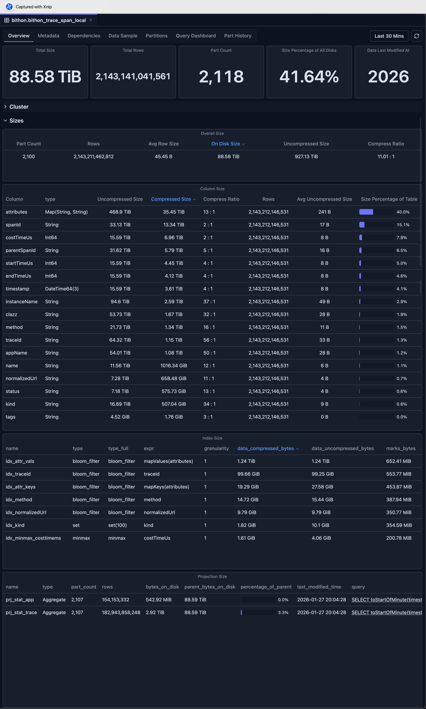
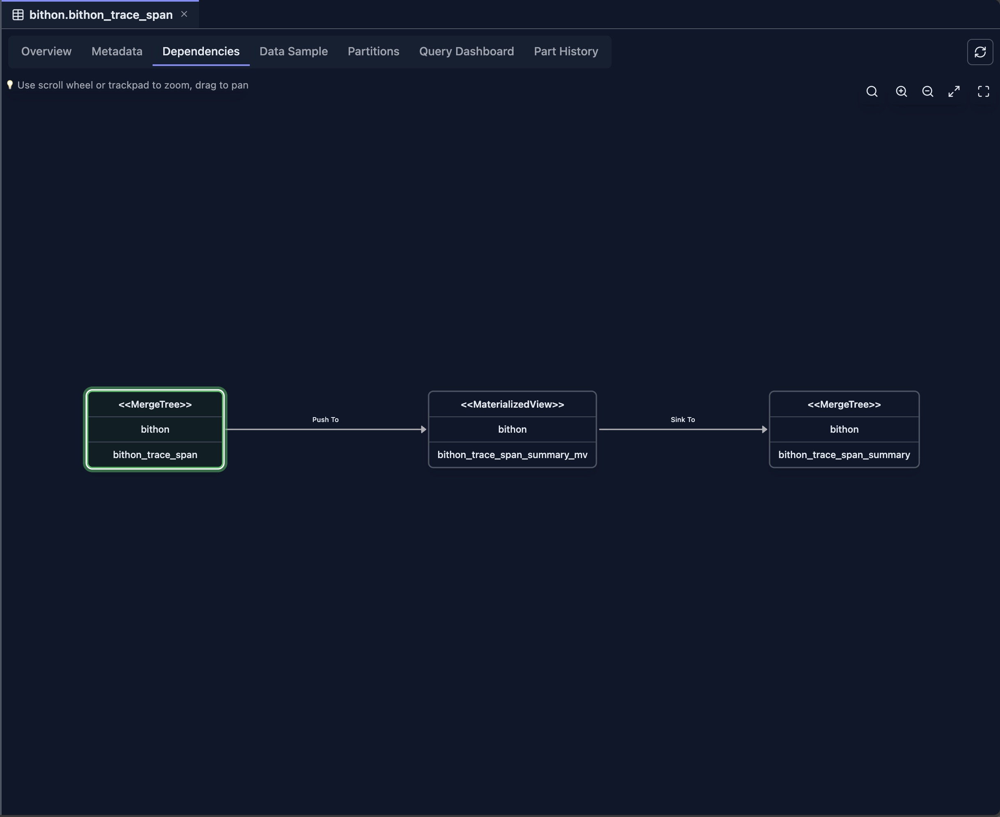
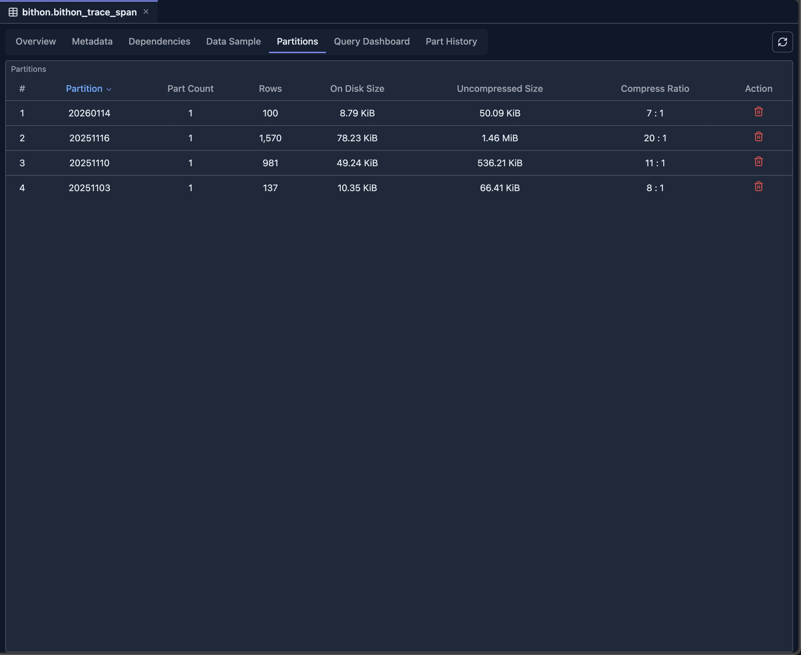
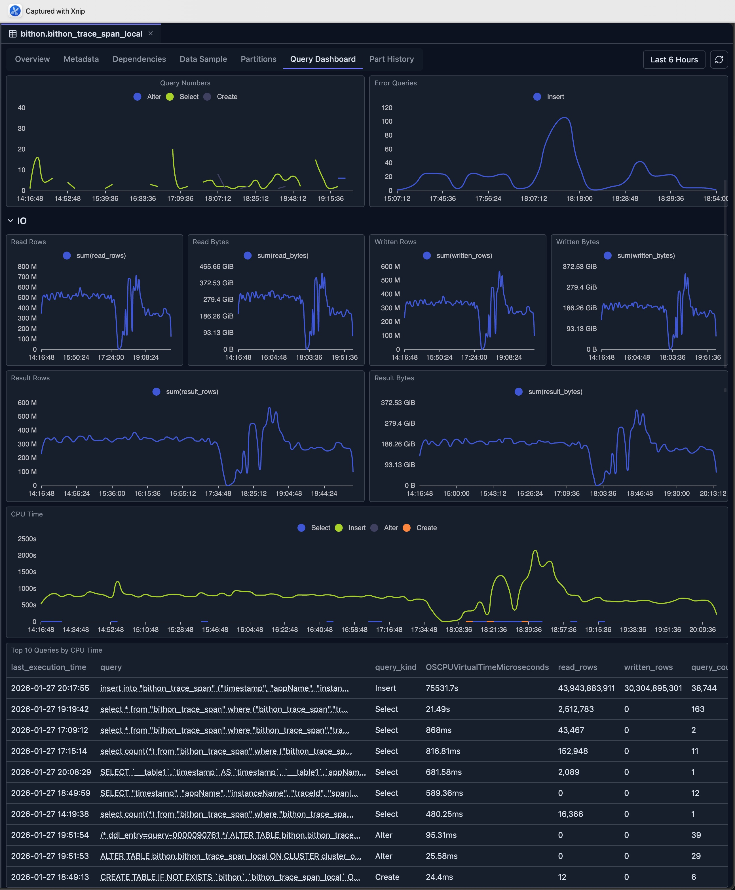
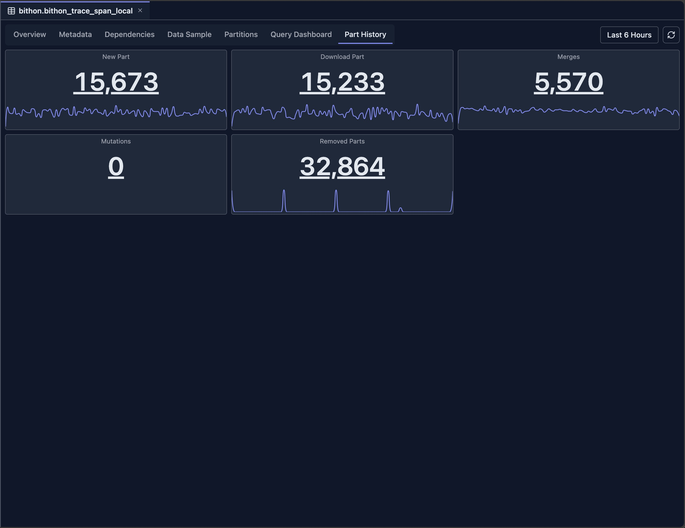

# Table View

The Table View provides comprehensive information about a ClickHouse table, including metadata, data samples, partition information, query history, and dependencies. It serves as a central hub for understanding table structure, performance, and relationships.

## Overview

The Table View organizes table information into multiple tabs:

- **Overview Tab**: High-level statistics and performance metrics
- **Metadata Tab**: Table structure, columns, and CREATE TABLE statement
- **Dependencies Tab**: Visual graph of table dependencies
- **Data Sample Tab**: Sample rows from the table
- **Partitions Tab**: Partition information and size distribution
- **Query Dashboard Tab**: Query history and performance metrics
- **Part History Tab**: Historical part information and changes

## Accessing the Table View

The Table View can be accessed from multiple locations in ClickHouse Console:

### From Schema Explorer

1. **Navigate to Table**: Click on a table name in the Schema Explorer sidebar
2. **Table Tab Opens**: The Table View opens automatically in a new tab
3. **View Overview**: The Overview tab is displayed by default (if available for the table engine type)

### From Database View

1. **Open Database View**: Click on a database name in the Schema Explorer
2. **Click Table Name**: Click on any table name in the database table list
3. **Table Tab Opens**: The Table View opens in a new tab with the selected table's information

## Available Tabs

The tabs available depend on the table engine type. Some engines have limited functionality:

| Table Engine | Overview | Metadata | Dependencies | Data Sample | Partitions | Query Dashboard | Part History |
|--------------|----------|----------|--------------|-------------|------------|------------------|--------------|
| **MergeTree family** | ✅ | ✅ | ✅ | ✅ | ✅ | ✅ | ✅ |
| **Materialized Views** | ✅ | ✅ | ✅ | ❌ | ✅ | ❌ | ❌ |
| **Distributed Tables** | ❌ | ✅ | ✅ | ✅ | ❌ | ✅ | ❌ |
| **Kafka Tables** | ❌ | ✅ | ✅ | ❌ | ❌ | ❌ | ❌ |
| **URL Tables** | ❌ | ✅ | ✅ | ❌ | ❌ | ❌ | ❌ |
| **System Tables** | ❌ | ✅ | ❌ | ✅ | ❌ | ❌ | ❌ |

### Engine-Specific Notes

- **MergeTree family**: Includes MergeTree, ReplicatedMergeTree, ReplacingMergeTree, SummingMergeTree, AggregatingMergeTree, CollapsingMergeTree, VersionedCollapsingMergeTree, and other MergeTree variants. All tabs are fully supported.
- **Materialized Views**: Support overview, metadata, dependencies, and partitions. Data sample and query history are not available as these are view definitions, not data tables.
- **Distributed Tables**: Support data sampling, metadata, dependencies, and query dashboard. Partitions and part history are not applicable as these tables distribute data across cluster nodes.
- **Kafka Tables**: Only metadata and dependencies are available. These tables read from Kafka streams and don't store data locally.
- **URL Tables**: Only metadata and dependencies are available. These tables read from external URLs and don't store data locally.
- **System Tables**: Support data sample and metadata. Dependencies and other advanced features are not available for system tables.

## Overview Tab

The Overview tab provides high-level statistics and performance metrics for the ClickHouse table, giving you a quick understanding of table size, row counts, part information, and performance characteristics.

### Key Metrics

- **Table Size**: Total size on disk
- **Row Count**: Total number of rows
- **Part Count**: Number of data parts
- **Compression Ratio**: Data compression efficiency
- **Last Modified**: Last modification time

### Performance Charts

- **Size Over Time**: Table size trends
- **Row Count Trends**: Row count changes over time
- **Query Performance**: Query execution metrics
- **Part Operations**: Merge and mutation activity

### Column Size Analysis

The Column Size section provides detailed insights into the storage size of each column in the table, helping you identify which columns consume the most disk space and optimize storage efficiency.

### Secondary Index Information

This section displays the size of each secondary index (data skipping index) used by the table, enabling you to monitor index overhead and optimize query performance.

### Projection Analysis

The Projection section shows the size of every PROJECTION used by this table, allowing you to understand the storage impact of projections and their contribution to query optimization.

## Metadata Tab

The Metadata tab displays detailed information about the table structure.

### Table Information

- **Database Name**: The database containing the table
- **Table Name**: The name of the table
- **Engine Type**: ClickHouse engine (MergeTree, ReplicatedMergeTree, etc.)
- **CREATE TABLE Statement**: Complete table definition
- **Metadata Modification Time**: When table metadata was last changed

### Column Information

For each column, view:

- **Column Name**: The name of the column
- **Data Type**: ClickHouse data type
- **Default Expression**: Default value or expression
- **Comment**: Column description (if available)
- **Codec**: Compression codec (if specified)
- **TTL**: Time-to-live expression (if specified)

### Table Properties

- **Partition Key**: Partitioning expression
- **Order By**: Sorting key
- **Primary Key**: Primary key definition
- **Sample By**: Sampling expression (if specified)
- **Settings**: Table-level settings and parameters

### Engine-Specific Information

- **Replication Settings**: For ReplicatedMergeTree tables
- **Distributed Settings**: For Distributed tables
- **Kafka Settings**: For Kafka tables
- **Other Engine Settings**: Engine-specific configuration

## Dependencies Tab

The Dependencies tab shows a visual graph of table dependencies of current table.

### Features

- **Upstream Dependencies**: Tables this table depends on
- **Downstream Dependencies**: Tables that depend on this table
- **Interactive Graph**: Navigate dependencies visually
- **Table Details**: Click nodes to view table information

For example, the following picture demonstrates the relationship among a Materialized View and its source table as well as its target table, showing how data flows through the materialized view pipeline.

For detailed information about the dependency view, see [Dependency View](./dependency-view.md).

## Data Sample Tab

The Data Sample tab displays sample rows from the table.

### Features

- **Sample Rows**: View actual data from the table
- **Configurable Sample Size**: Adjust number of rows displayed
- **Column Display**: All columns with proper formatting
- **Sorting**: Sort by any column
- **Filtering**: Filter rows by column values
- **Export**: Export sample data

### Use Cases

- **Data Exploration**: Understand table contents
- **Data Quality**: Verify data correctness
- **Schema Validation**: Confirm column types and values
- **Query Planning**: Understand data structure for queries

## Partitions Tab

The Partitions tab provides detailed partition information of current table.

### Partition Overview

- **Partition List**: All partitions in the table
- **Partition Key Values**: Values used for partitioning
- **Size Information**: Size per partition
- **Row Count**: Rows per partition
- **Part Count**: Number of parts per partition

## Query Dashboard Tab

The Query Dashboard tab shows query history and performance metrics based on the `system.query_log`.

It provides several dashboard metrics to help users understand the query performance on the current table, including execution times, query frequency, and performance trends.

### Use Cases

- **Performance Monitoring**: Track query performance
- **Optimization**: Identify slow queries for optimization
- **Usage Analysis**: Understand how the table is being used
- **Troubleshooting**: Debug query performance issues

## Part History Tab

The Part History tab shows historical information about table parts based on `system.part_log` system table.

On each panel, you can click either the number or drag on the minimap to view the detailed logs.

## Limitations

The Table View has both engine-specific and general limitations that you should be aware of:

### Engine-Specific Limitations

- **System Tables**: Limited functionality for system tables, as they have different structures and purposes compared to user tables
- **Kafka Tables**: No data sample or partitions available, as Kafka tables read from streams and don't store data locally
- **URL Tables**: Limited metadata and no data sample, as URL tables fetch data from external sources on-demand
- **External Tables**: May have limited functionality depending on the external table engine type and its capabilities

### General Limitations

- **System Table Access**: Requires read access to ClickHouse system tables (`system.tables`, `system.parts`, `system.query_log`, `system.part_log`, etc.)
- **Data Retention**: Historical data depends on system table retention policies configured in ClickHouse
- **Performance Impact**: Querying large tables with many parts may be slow, especially when loading comprehensive statistics and historical data
- **Real-time Accuracy**: Some metrics may have slight delays as they are based on system table snapshots rather than real-time data
- **Version Compatibility**: Some features may not be available in older ClickHouse versions, as they depend on specific system table columns and functionality introduced in newer versions

## Integration with Other Features

- **Schema Explorer**: Navigate to related tables
- **Database View**: Access database-level information
- **Dependency View**: Explore table dependencies
- **Query Editor**: Use table information when writing queries
- **Query Log Inspector**: Analyze query performance in detail

## Next Steps

- **[Dependency View](./dependency-view.md)** — Explore table dependencies and relationships
- **[Database View](./database-view.md)** — View database-level statistics
- **[Query Log Inspector](../03-query-experience/query-log-inspector.md)** — Analyze query performance
- **[Schema Explorer](./schema-explorer.md)** — Navigate database structure
- **[SQL Editor](../03-query-experience/sql-editor.md)** — Query your tables
